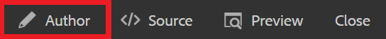

# Erstellen einer Zuordnung

Eine Zuordnung ist ein organisatorisches Tool, mit dem Sie Informationen in einer hierarchischen Struktur hinzufügen und organisieren können. Diese Aufgabe zeigt Ihnen, wie Sie eine Karte erstellen und den Inhalt in der Karte organisieren.

Beispiele für DITA-Dateien können hier heruntergeladen werden:

* [Documents-with-Visual-Content.dita](assets/working-with-maps/Documents-with-Visual-Content.dita)
* [Working-with-Tables.dita](assets/working-with-maps/Working-with-Tables.dita)

>[!VIDEO](https://video.tv.adobe.com/v/336725?quality=12&learn=on)

## Hochladen von Zuordnungskomponenten

Bei Bedarf können Sie lokale Beispieldateien in AEM hochladen, um einen umfassenderen Materialsatz zu erhalten.

1. Ziehen Sie lokale Dateien per Drag-and-Drop in AEM, um sie hochzuladen.
1. Wiederholen Sie den Vorgang nach Bedarf für alle Dateien, einschließlich Bilder und Themen.

## Erstellen einer Zuordnung

1. Um das Menü [!UICONTROL Optionen] zu öffnen, klicken Sie auf das Symbol mit den Auslassungspunkten im Hauptordner .

   

1. Wählen **[!UICONTROL Erstellen]** > **[!UICONTROL Zuordnung]**.

   

   Das [!UICONTROL Neue Zuordnung erstellen] wird angezeigt.

1. Wählen Sie im Feld [!UICONTROL Vorlage] aus **[!UICONTROL Dropdown-Menü]** Bookmap“ aus und geben Sie Ihrer Karte einen Titel.
1. Wählen Sie **[!UICONTROL Erstellen]** aus.

   Ihre Zuordnung wird erstellt und die linke Leiste wechselt automatisch von der Repository-Ansicht zur Zuordnungsansicht.

## Einfügen von Zuordnungskomponenten

1. Wählen Sie das Stiftsymbol in der linken Leiste aus.

   

   Dies ist das Symbol Bearbeiten , über das Sie die Karte im Editor öffnen können.

1. Wechseln Sie zurück zur Repository-Ansicht, indem Sie das Repository -Symbol auswählen.

   

1. Fügen Sie der Karte ein Thema hinzu, indem Sie es aus dem Repository auf die Karte im Editor ziehen und ablegen.

   Die Zeilenanzeige zeigt an, wo das Thema platziert ist.

1. Fügen Sie weitere Themen hinzu, falls erforderlich.

## Kartenvorschau anzeigen

Die Vorschau bietet einen schnellen Überblick über den Inhalt unter Verwendung von Standardformaten. Es werden die Überschriften, Absätze, Listen und alle anderen Inhalte in den Themen angezeigt.

1. Wählen **[!UICONTROL Vorschau]** in der oberen schwarzen Menüleiste aus.

   

Ihr Inhalt wird in &quot;[!UICONTROL &quot; ].

1. Um zur Autorenansicht zurückzukehren und die Kartenbearbeitung fortzusetzen, wählen Sie **Autor.**

   

## Konfigurieren der Zuordnungsstruktur

Sie können die Hierarchie der Themen innerhalb der Zuordnung bearbeiten.

1. Klicken Sie auf das Symbol eines Themas, um es auszuwählen.
1. Verwenden Sie die Pfeile zum Herabstufen bzw. Hochstufen von Elementen.

   

## Zuordnung als neue Version speichern

Nachdem die Zuordnung abgeschlossen ist, können Sie Ihre Arbeit als neue Version speichern und Ihre Änderungen aufzeichnen.

1. Wählen Sie das **[!UICONTROL Als neue Version speichern]**.

   

1. Geben Sie im Feld Kommentare für neue Version eine kurze, aber klare Zusammenfassung der Änderungen ein.

1. Geben Sie im Feld Versionsbezeichnungen alle relevanten Bezeichnungen ein.

   Mit Beschriftungen können Sie die Version angeben, die Sie bei der Veröffentlichung einbeziehen möchten.

   >[!NOTE]
   > 
   > Wenn Ihr Programm mit vordefinierten Kennzeichnungen konfiguriert ist, können Sie diese auswählen, um eine konsistente Kennzeichnung sicherzustellen.

1. Wählen Sie **Speichern** aus.

   Sie haben eine neue Version Ihrer Zuordnung erstellt und die Versionsnummer wird aktualisiert.
