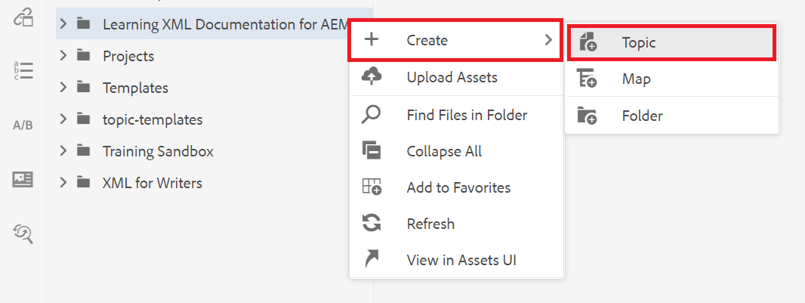

# Inhalte erstellen und strukturieren

Nachdem Sie sich mit der Benutzeroberfläche vertraut gemacht haben, können Sie mit der Erstellung und Strukturierung Ihrer eigenen Inhalte beginnen.

>[!VIDEO](https://video.tv.adobe.com/v/336657?quality=12&learn=on)

## Erstellen von Ordnern

1. Wählen Sie das **Repository**-Symbol aus, um Ihre Ordner und Dateien anzuzeigen.

   

1. Wählen Sie das Symbol **+** und **Ordner** aus.

   

1. Geben Sie dem Ordner einen Titel.
1. Wählen Sie **Erstellen** aus.
Sie haben einen neuen Ordner erstellt, der jetzt im Repository angezeigt wird. Dieser Ordner ist die Startseite für alle Kursinhalte.

## Erstellen von Unterordnern

Wir können jetzt innerhalb Ihres neuen Ordners einen Ordner erstellen, der Bilder oder andere Inhalte enthält.

1. Bewegen Sie den Mauszeiger über den neuen Ordner im Repository und wählen Sie das angezeigte Auslassungssymbol aus.

   

   Das Menü Optionen wird angezeigt.

1. Wählen Sie **Ordner erstellen \>**.
   

1. Geben Sie dem Unterordner einen Titel (z. B. „Bilder„) und wählen Sie **Erstellen**.

## Erstellen und Ausfüllen eines neuen Konzepts

1. Bewegen Sie den Mauszeiger über den übergeordneten Ordner im Repository und wählen Sie das Symbol mit den Auslassungspunkten aus.

   

   Das Menü Optionen wird angezeigt.

1. Wählen Sie **Thema erstellen \>**.

   

   Das Dialogfeld Neues Thema erstellen wird angezeigt.

1. Wählen Sie im Dropdown-Menü Vorlage im Dialogfeld die Option **Konzept** aus.

   

1. Geben Sie Ihrem Konzept einen Titel und wählen Sie **Erstellen**.

   Das neue Konzept wird im Editor angezeigt und mit seinem Titel gefüllt.

   

1. Füllen Sie das Konzept, indem Sie entweder auf die Kurzbeschreibung oder den Absatz klicken und Ihren Inhalt eingeben.

## Speichern und als neue Version speichern

Sie können Ihre Arbeit jederzeit mit Speichern oder Als neue Version speichern. Verwenden Sie Speichern , um Ihre Änderungen zu speichern, und verwenden Sie Als neue Version speichern , um eine neue Version Ihres Themas mit den aktuellen Änderungen zu erstellen.

### Speichern von Arbeit ohne Versionierung

1. Wählen Sie das Symbol **Speichern** aus.

   

### Speichern als neue Version

1. Wählen Sie das **Als neue Version speichern** rechts neben dem Symbol Speichern .

   

   Das Dialogfeld Als neue Version speichern wird angezeigt.

1. Geben Sie im Feld Kommentare für neue Version eine kurze, aber klare Zusammenfassung der Änderungen ein.
1. Geben Sie im Feld Versionsbezeichnungen alle relevanten Bezeichnungen ein.

   Mit Beschriftungen können Sie die Version angeben, die Sie bei der Veröffentlichung einbeziehen möchten.

   >[!NOTE]
   > 
   > Wenn Ihr Programm mit vordefinierten Kennzeichnungen konfiguriert ist, können Sie diese auswählen, um eine konsistente Kennzeichnung sicherzustellen.

1. Wählen Sie **Speichern** aus.

   Sie haben eine neue Version Ihres Themas erstellt und die Versionsnummer wird aktualisiert.
