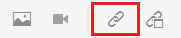

# Verknüpfen mit Websites

Über Weblinks gelangen Leser zu Websites, auf denen sie weitere Informationen erhalten, mit externen Inhalten interagieren oder auf die sie herunterladen können. In den folgenden Schritten wird beschrieben, wie Sie einem vorhandenen Konzept einen Weblink hinzufügen.

>[!VIDEO](https://video.tv.adobe.com/v/336656?quality=12&learn=on)

## Link einfügen

1. Wählen Sie Ihr Konzept aus dem Repository aus und öffnen Sie es im Editor.
1. Fügen Sie Ihrem Konzept eine Textzeichenfolge hinzu und markieren Sie es oder markieren Sie einen vorhandenen Text Ihrer Wahl.

   In diesen hervorgehobenen Text wird Ihr Link eingefügt.
1. Wählen Sie in **Symbolleiste die Schaltfläche** Querverweis einfügen“.

   

   Das Dialogfeld „Referenz“ wird angezeigt.

1. Wählen **Weblink** aus dem linken Menü aus.
1. Fügen Sie die gewünschte URL ein und klicken Sie dann auf **Auswählen**.

   Der Link funktioniert und öffnet eine Web-Seite in einer neuen Browser-Registerkarte, wenn Sie darauf klicken.

## Verwenden der Vorschau zum Testen von Links

Mit der Schaltfläche Vorschau können Sie eine Vorschau eines Themas anzeigen. Hier können Sie Ihre Links testen und wie Ihre Zielgruppe anzeigen.

1. Wählen **Vorschau** in der oberen schwarzen Menüleiste aus.

   

   Ihr Konzept wird in der Vorschau geöffnet.

1. Link auswählen.
Das Link-Ziel wird in einer anderen Registerkarte geöffnet.
1. Kehren Sie zur Autorenansicht zurück, indem **Autor** in der oberen schwarzen Menüleiste auswählen.

   

## Speichern als neue Version

Nachdem Sie Ihrem Konzept weitere Inhalte hinzugefügt haben, können Sie Ihre Arbeit als neue Version speichern und Ihre Änderungen aufzeichnen.

1. Wählen Sie das **Als neue Version speichern**.

   

1. Geben Sie im Feld Kommentare für neue Version eine kurze, aber klare Zusammenfassung der Änderungen ein.
1. Geben Sie im Feld Versionsbezeichnungen alle relevanten Bezeichnungen ein.

   Mit Beschriftungen können Sie die Version angeben, die Sie bei der Veröffentlichung einbeziehen möchten.

   >[!NOTE]
   > 
   > Wenn Ihr Programm mit vordefinierten Kennzeichnungen konfiguriert ist, können Sie diese auswählen, um eine konsistente Kennzeichnung sicherzustellen.

1. Wählen Sie **Speichern** aus.

   Sie haben eine neue Version Ihres Themas erstellt und die Versionsnummer wird aktualisiert.
