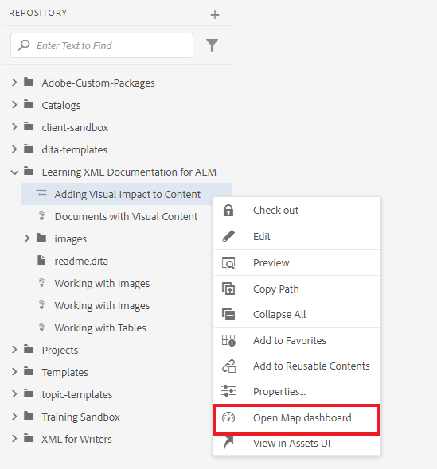
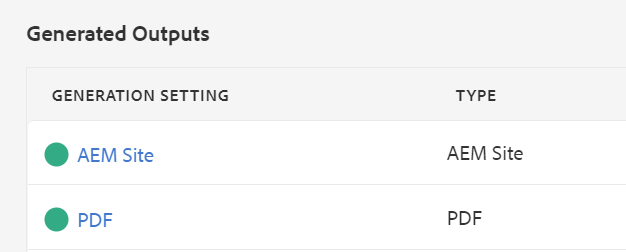

# Standardausgabe wird veröffentlicht

Sobald Sie eine fertige Zuordnung haben, können Sie Ihre Inhalte in mehreren Ausgabeformaten veröffentlichen.

>[!VIDEO](https://video.tv.adobe.com/v/336662?quality=12&learn=on)

## Veröffentlichen der Karte als AEM-Site und PDF

Es stehen eine Reihe von Ausgabevorgaben zur Auswahl. Dieses Handbuch konzentriert sich auf die Ausgaben von AEM Site und PDF.

1. Wählen Sie im Repository das Symbol mit den Auslassungspunkten auf Ihrer Zuordnung aus, um das Menü „Optionen“ zu öffnen, und klicken Sie dann auf **In Karten-Dashboard öffnen**

   

   Das Zuordnungs-Dashboard wird auf einer anderen Registerkarte geöffnet.

1. Wählen Sie auf der Registerkarte „Ausgabevorgaben“ AEM-Site und PDF aus.

   

1. Wählen Sie **Generieren.**

1. Navigieren Sie zur Seite „Ausgaben“, um den Status Ihrer generierten Ausgaben anzuzeigen.

   Ein grüner Kreis bedeutet, dass die Generierung abgeschlossen ist.

   

## Die AEM-Site-Ausgabe

In der Ausgabe der AEM-Site werden Themen, Listen, Bilder, Titel, Tabellen und andere mit dem XML-Editor erstellte Inhalte von AEM automatisch in Web-freundlichen Inhalten veröffentlicht.

Untergeordnete Themen werden im Inhaltsverzeichnis sowie im Abschnitt mit den zugehörigen Informationen angezeigt. Diese Links können alle zur Navigation verwendet werden.

## Die PDF-Ausgabe

Das fertige PDF-Dokument enthält den Standardtitel der Zuordnung als Haupttitel auf der Titelseite. Kapitelabdeckungsseiten sind mit der Kapitelnummer formatiert und enthalten Links zu den darin enthaltenen Themen.
