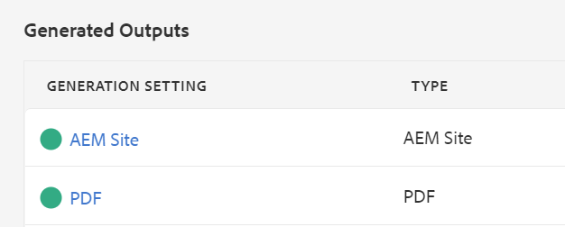

# Standardausgabe wird veröffentlicht

Sobald Sie eine fertige Zuordnung haben, können Sie Ihre Inhalte in mehreren Ausgabeformaten veröffentlichen.

>[!VIDEO](https://video.tv.adobe.com/v/336662?quality=12&learn=on)

## Veröffentlichen der Karte als AEM-Site und PDF

Es stehen eine Reihe von Ausgabevorgaben zur Auswahl. Dieses Handbuch konzentriert sich auf die AEM-Site- und PDF-Ausgaben.

1. Wählen Sie im Repository das Symbol mit den Auslassungspunkten auf Ihrer Zuordnung aus, um das Menü „Optionen“ zu öffnen, und klicken Sie dann auf **In Karten-Dashboard öffnen**

   

   Das Zuordnungs-Dashboard wird auf einer anderen Registerkarte geöffnet.

1. Wählen Sie auf der Registerkarte „Ausgabevorgaben“ AEM-Site und PDF aus.

   

1. Wählen Sie **Generieren.**

1. Navigieren Sie zur Seite „Ausgaben“, um den Status Ihrer generierten Ausgaben anzuzeigen.

   Ein grüner Kreis bedeutet, dass die Generierung abgeschlossen ist.

   

## Die AEM-Site-Ausgabe

In der AEM-Site-Ausgabe werden Themen, Listen, Bilder, Titel, Tabellen und andere mit dem XML-Editor erstellte Inhalte von AEM automatisch für Web-freundliche Inhalte veröffentlicht.

Untergeordnete Themen werden im Inhaltsverzeichnis sowie im Abschnitt mit den zugehörigen Informationen angezeigt. Diese Links können alle zur Navigation verwendet werden.

## Die PDF-Ausgabe

Das fertige PDF-Dokument enthält den Standardtitel der Karte als Haupttitel auf der Titelseite. Kapitelabdeckungsseiten sind mit der Kapitelnummer formatiert und enthalten Links zu den darin enthaltenen Themen.
