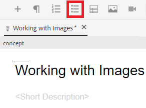
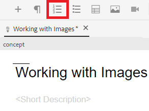

# Arbeiten mit Listen

Möglicherweise benötigen Sie Aufzählungslisten und nummerierte Listen, um Ihre Informationen zu organisieren. Im Folgenden erfahren Sie, wie Sie Listen in ein vorhandenes Konzept einfügen und damit arbeiten können.

>[!VIDEO](https://video.tv.adobe.com/v/336658?quality=12&learn=on)

## Aufzählungslisten

Wenn Listenkomponenten nicht in einer bestimmten Reihenfolge angeordnet werden müssen, sollten Aufzählungslisten oder ungeordnete Listen verwendet werden.

### Aufzählungsliste einfügen

1. Wählen Sie das **Aufzählungsliste einfügen** aus der Symbolleiste aus.

   

   Ein Aufzählungspunkt wird angezeigt. Das ist der Anfang Ihrer Liste.

1. Geben Sie Ihr erstes Listenelement ein.
1. Drücken Sie die Eingabetaste, um einen zweiten Eintrag zu erstellen, und geben Sie Ihren Inhalt ein.
1. Fügen Sie Listenelemente nach Bedarf hinzu.

## Nummerierte Listen

Eine nummerierte Liste sollte verwendet werden, wenn Listenkomponenten auf eine bestimmte Weise sortiert oder strukturiert werden müssen.

### Sortierte Liste einfügen

1. Wählen Sie in **Symbolleiste das Symbol** Nummerierte Liste einfügen“ aus.

   

   Eine Zahl wird angezeigt. Das ist der Anfang Ihrer Liste.

1. Geben Sie Ihr erstes Listenelement ein.
1. Drücken Sie die Eingabetaste, um einen zweiten Eintrag zu erstellen, und geben Sie Ihren Inhalt ein.
1. Fügen Sie Listenelemente nach Bedarf hinzu.

## Speichern als neue Version

Nachdem Sie Ihrem Konzept weitere Inhalte hinzugefügt haben, können Sie Ihre Arbeit als neue Version speichern und Ihre Änderungen aufzeichnen.

1. Wählen Sie das **Als neue Version speichern**.

   

1. Geben Sie im Feld Kommentare für neue Version eine kurze, aber klare Zusammenfassung der Änderungen ein.
1. Geben Sie im Feld Versionsbezeichnungen alle relevanten Bezeichnungen ein.

   Mit Beschriftungen können Sie die Version angeben, die Sie bei der Veröffentlichung einbeziehen möchten.

   >[!NOTE]
   > 
   >Wenn Ihr Programm mit vordefinierten Kennzeichnungen konfiguriert ist, können Sie diese auswählen, um eine konsistente Kennzeichnung sicherzustellen.

1. Wählen Sie **Speichern** aus.

   Sie haben eine neue Version Ihres Themas erstellt und die Versionsnummer wird aktualisiert.
