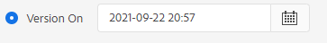
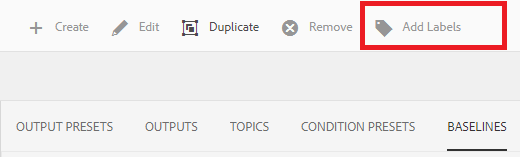
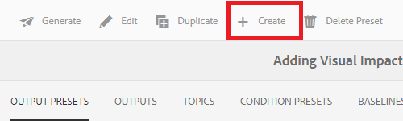

# Erstellen und Veröffentlichen mit Baselines

Durch die Verwendung einer Baseline können Sie eine Version Ihrer Zuordnungsthemen und zugehörigen Referenzinhalte erstellen. Dies kann auf einem bestimmten Datum oder einer bestimmten Uhrzeit oder auf Kennzeichnungen basieren.

>[!VIDEO](https://video.tv.adobe.com/v/338993?quality=12&learn=on)

## Zugriff auf die Registerkarte „Baselines“ im Karten-Dashboard

Sie können auf Ihre Baselines im Karten-Dashboard zugreifen.

1. Repository-Ansicht, wählen Sie das Symbol mit den Auslassungspunkten auf Ihrer Karte aus, um das Menü „Optionen“ zu öffnen, und **Map-Dashboard öffnen.**

   
Das Zuordnungs-Dashboard wird auf einer anderen Registerkarte geöffnet.

1. Wählen Sie **Baselines** aus.

   

Die Registerkarte Baselines wird angezeigt.

## Erstellen einer Baseline basierend auf Kennzeichnungen

1. Wählen Sie auf der Registerkarte „Baselines“ die Option **Erstellen**.

   

   Die Informationen zur neuen Baseline werden angezeigt. Der Standardname basiert auf dem Erstellungsdatum.

1. Geben Sie Ihrer Baseline bei Bedarf einen neuen Namen.

1. Wählen Sie unter der Überschrift „Version festlegen auf“ den Kreis für Beschriftung.
   

   >[!NOTE]
   >
   >HINWEIS: *Kontrollkästchen „Neueste Version verwenden, wenn die Bezeichnung nicht vorhanden ist* ist standardmäßig aktiviert. Wenn diese Option nicht ausgewählt ist und Themen oder Mediendateien ohne die ausgewählte Bezeichnung in Ihrer Zuordnung vorhanden sind, schlägt der Erstellungsprozess der Baseline fehl.

1. Geben Sie den Titel ein, den Sie verwenden möchten.

1. Wählen Sie **Speichern** aus.

Ihre Baseline wird erstellt. Eine Tabelle mit allen Themen und den zugehörigen Informationen wird angezeigt.

### Verwenden der Funktion Alle Themen durchsuchen

Mit der Funktion Alle Themen durchsuchen können Sie die Informationen zum Thema, einschließlich Version und Titel, anzeigen und die verwendete Version angeben. Sie können darauf zugreifen, indem Sie **Alle Themen durchsuchen** beim Erstellen oder Bearbeiten Ihrer Baseline auswählen.

## Erstellen einer Baseline basierend auf Datum und Uhrzeit

Sie können auch Baselines erstellen, die eine Momentaufnahme darstellen.

1. Stellen Sie sicher, dass die Registerkarte Baselines geöffnet ist, und wählen Sie Erstellen aus.

   

1. Wählen Sie unter der Überschrift „Version festlegen auf“ den Kreis für „Version ein“.

   

1. Wählen Sie das Kalendersymbol aus und geben Sie das gewünschte Datum und die gewünschte Uhrzeit an.

   

1. Geben Sie Ihrer Baseline bei Bedarf einen neuen Namen.

1. Wählen Sie **Speichern** aus.

Ihre Baseline wird erstellt. Eine Tabelle mit allen Themen und den zugehörigen Informationen wird angezeigt.

### Hinzufügen von Kennzeichnungen zu Ihrer Baseline

Möglicherweise möchten Sie allen Zuordnungsinhalten stapelweise eine neue Beschriftung zuweisen.

1. Wählen Sie die Baseline aus, für die Sie Kennzeichnungen hinzufügen möchten.

1. Wählen Sie **Kennzeichnungen hinzufügen** aus.

   

   Das Dialogfeld Kennzeichnung hinzufügen wird angezeigt.

1. Geben Sie den Titel ein, den Sie zuweisen möchten, und wählen Sie **Hinzufügen** aus.

Die Bezeichnung wurde allen Themen hinzugefügt.

## Generieren einer AEM-Site-Ausgabe mithilfe einer Grundlinie

1. Navigieren Sie im Zuordnungs-Dashboard zur Registerkarte „Ausgabevorgaben“.

1. Aktivieren Sie das Kontrollkästchen AEM-Site .

   

1. Wählen Sie **Bearbeiten** aus.

   

   Eine neue Seite wird angezeigt.

1. Aktivieren Sie das Kontrollkästchen Baseline verwenden und wählen Sie in der Dropdown-Liste die Baseline aus, die Sie verwenden möchten.

   

1. Wählen Sie **Fertig**.

   

1. Wählen Sie **Generieren**.

   

   Ihre Ausgabe wurde mit einer Baseline generiert.

## Anzeigen der generierten Ausgabe

1. Navigieren Sie im Zuordnungs-Dashboard zur Registerkarte „Ausgaben“.

1. Wählen Sie den Text in der Spalte Erzeugungseinstellungen aus, um die Ausgabe zu öffnen.
   

## Entfernen einer Baseline

1. Wählen Sie auf der Registerkarte Baselines die Baseline aus, die Sie entfernen möchten.

1. Wählen Sie **Entfernen** aus.

   

   Das Dialogfeld Baseline entfernen wird angezeigt.

1. Wählen Sie **Entfernen** aus.

Die Baseline wird entfernt.

## Baseline duplizieren

1. Wählen Sie auf der Registerkarte Baselines die Baseline aus, die Sie duplizieren möchten.

1. Wählen Sie **Duplizieren** aus.

   

1. Wählen Sie **Speichern** aus.

   

Die doppelte Baseline wird erstellt.

## Ändern einer Grundlinie

Sie können die Version eines Themas, das in einer Baseline verwendet wird, direkt angeben.

1. Wählen Sie auf der Registerkarte Baselines die Baseline aus, die Sie ändern möchten.
1. Wählen Sie **Bearbeiten** aus.

   

1. Wählen **Alle Themen durchsuchen** aus.

   

   Eine Tabelle mit Themen und den zugehörigen Informationen wird angezeigt.

1. Wählen Sie für die Themen, die Sie ändern möchten, die gewünschte Version aus der Dropdown-Liste unter der Spalte Version aus.

   

1. Wählen Sie **Speichern** aus.

Ihre Änderungen wurden gespeichert. Ihre Grundlinie verwendet jetzt die Versionen des von Ihnen angegebenen Themas.

## Erstellen einer benutzerdefinierten AEM-Site-Ausgabevorgabe

Es ist schwierig, auf der Registerkarte „Ausgaben“ zwischen Standardausgaben desselben Typs zu unterscheiden. Durch die Verwendung einer benutzerdefinierten Ausgabevorgabe mit einem eindeutigen und benutzerfreundlichen Namen können Sie dieses Problem beheben.

In diesem Fall erstellen wir eine Ausgabevorgabe basierend auf einer Grundlinie.

1. Navigieren Sie im Zuordnungs-Dashboard zur Registerkarte „Ausgabevorgaben“.

1. Wählen Sie **Erstellen** aus.

   

   Eine neue Seite mit einer Ausgabevorgabe wird angezeigt, die als Neue Ausgabe bezeichnet wird.
1. Geben Sie im Feld Name der Einstellung einen benutzerfreundlichen Namen ein.

1. Aktivieren Sie das Kontrollkästchen Baseline verwenden und wählen Sie die gewünschte Baseline aus dem Dropdown-Menü aus.

   

1. Wählen Sie **Fertig**.

Ihre neue Ausgabevorgabe wurde erstellt und wird auf der Seite „Ausgabevorgaben“ angezeigt.
