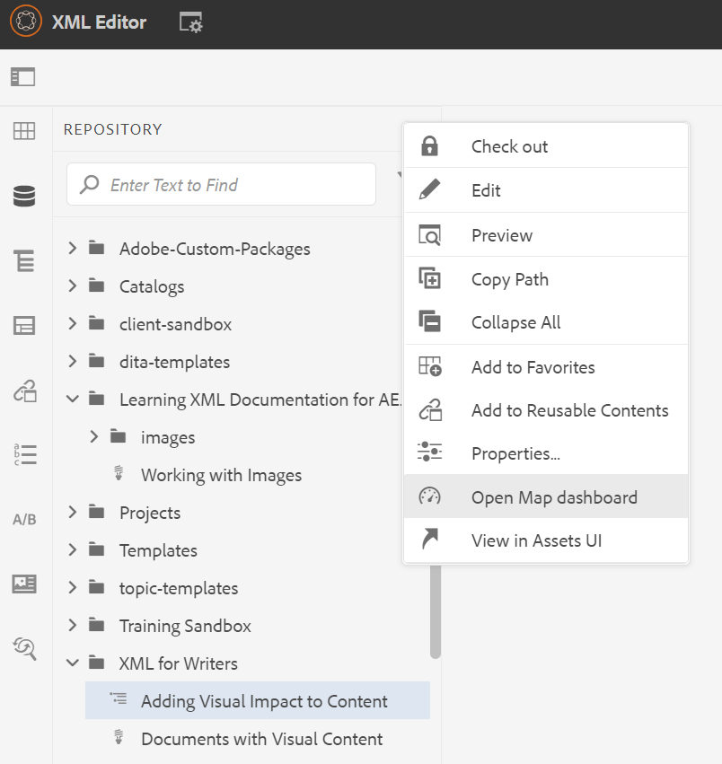
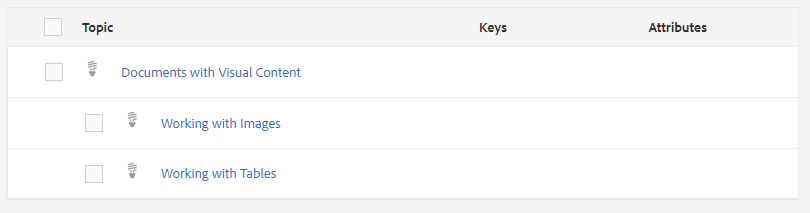

# Einführung in das Zuordnungs-Dashboard

Im Folgenden finden Sie einen Überblick über die wichtigsten Funktionen des Zuordnungs-Dashboards.

>[!VIDEO](https://video.tv.adobe.com/v/339040?quality=12&learn=on)

## Eine Karte im Karten-Dashboard öffnen

1. Wählen Sie in der Repository-Ansicht das Symbol mit den Auslassungspunkten auf Ihrer Zuordnung aus, um das Menü „Optionen“ zu öffnen, und öffnen Sie dann das Zuordnungs-Dashboard.
   

   Das Zuordnungs-Dashboard wird auf einer anderen Registerkarte geöffnet.

## Komponenten des Karten-Dashboards

Das Zuordnungs-Dashboard enthält eine Reihe von Registerkarten, einschließlich Ausgabevorgaben, Ausgabeergebnissen, verwendetem Thema, Baselines und mehr.

### Ausgabevoreinstellungen

Auf der Registerkarte „Ausgabevorgaben“ werden die Standardvorgaben für die verschiedenen Ausgabetypen angezeigt: AEM-Site, PDF, HTML5, ePub und Benutzerdefiniert.

Sie können eine Ausgabevorgabe auswählen, um die Details ihrer Einstellungen anzuzeigen, einschließlich des Umwandlungsnamens, des Zielpfads, der Baselines und der angewendeten Bedingungen.

### Ausgaben

Auf der Registerkarte „Ausgaben“ werden alle zuvor generierten und derzeit generierten Ausgaben angezeigt.

Ein grüner Kreis in der Spalte Erzeugungseinstellungen zeigt an, dass die Ausgabe erfolgreich generiert wurde. Der Text in dieser Spalte dient als aktiver Hyperlink, und Sie können ihn auswählen, um die generierte Ausgabe zu öffnen. Die Einträge in der Spalte Typ geben den Ausgabetyp an.
Hier werden auch andere Informationen zur Ausgabegenerierung angezeigt, einschließlich des Namens des Benutzers, der die Ausgabe generiert hat, des Datums und der Uhrzeit der Generierung sowie der Zeit, die für die Generierung benötigt wurde. Wenn bei der Generierung ein Fehler auftritt, können Sie das Datum und die Uhrzeit der Generierung in der Spalte Generiert am auswählen, um das Fehlerprotokoll zu öffnen und zu überprüfen.

### Themen

Auf der Registerkarte Themen wird eine Liste aller Themen in der Karte angezeigt.

Durch Auswahl des Kontrollkästchens eines Themas können Sie zusätzliche Aktionen durchführen. Sie können sie bearbeiten, neu generieren und ihre Tags anzeigen, anwenden oder ausblenden.

### Bedingungsvorgaben

Auf der Registerkarte „Bedingungsvorgaben“ werden die Einstellungen für bestimmte bedingte Inhalte angezeigt, die ein- oder ausgeschlossen werden sollen.

Hier führt die Auswahl des Kontrollkästchens für die Bearbeitung nur mit Schreibkraft zu einer Ausgabe, die alle Inhalte mit dem Attribut „Zielgruppe“ ausschließt, das die Kennzeichnung „Designer“ aufweist, und alle Inhalte mit der Kennzeichnung „Schreibkräfte“ einschließt.

### Baselines

Auf der Registerkarte Baselines können Sie Ihre Baselines anzeigen.

Baselines dienen als Momentaufnahmen und ermöglichen es Ihnen, eine Version Ihrer Themen und Assets zur Veröffentlichung zu erstellen. Beispielsweise kann eine Baseline, die Inhalte zu einem bestimmten Datum und zu einer bestimmten Uhrzeit erfasst, Version 1.3 eines Themas und 1.0 eines anderen Themas verwenden, basierend auf den jeweiligen Versionen zu diesem Zeitpunkt.
Wenn keine Baseline angegeben ist, wird die Ausgabe mit den neuesten Versionen des gesamten Inhalts generiert.

### Berichte

Auf der Registerkarte Berichte wird eine Zusammenfassung der Themeninformationen angezeigt, einschließlich der Anzahl der insgesamt verwendeten Themen, fehlender Elemente innerhalb dieser Themen und des Dokumentstatus.

Wenn in einem Thema ein Element fehlt, können Sie den Pfeil nach rechts in der Zeile auswählen, um den Eintrag zu erweitern und Details zum Fehler anzuzeigen.
