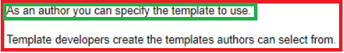
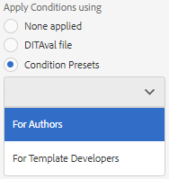

# Veröffentlichung mit Bedingungen

Bedingte Veröffentlichung ermöglicht das Schreiben einer Inhaltsquelle für eine oder mehrere Zielgruppen, Produkte oder Plattformen. Diese Informationen können dann dynamisch veröffentlicht werden und es können nur speziell erforderliche Inhalte in die Ausgabe aufgenommen werden.

>[!VIDEO](https://video.tv.adobe.com/v/339041?quality=12&learn=on)

## Vorbereitung für die Übung

Beispieldateien für die Übung können hier heruntergeladen werden.

[Übung-Download](assets/exercises/publishing-with-conditions.zip)

## Inhalte mit bedingten Attributen markieren

1. Öffnen Sie das zu ändernde Thema.

1. Geben Sie den Text ein, der bedingt werden soll. Beispielsweise einen oder mehrere Absätze, eine gesamte Tabelle, eine Abbildung oder andere Inhalte.

   

1. Wählen Sie den spezifischen Inhalt aus, dem ein bedingtes Attribut zugewiesen werden soll. Beispiel: ein einzelner Absatz innerhalb der Quelle.

   

1. Stellen Sie sicher, dass in der rechten Leiste die Eigenschaften angezeigt werden.

1. Attribut für Zielgruppe, Produkt oder Plattform hinzufügen.

1. Weisen Sie dem Attribut einen Wert zu. Die Aktualisierungen der Inhaltsanzeige zeigen jetzt bedingtes Markup an.

   

## Vorschau von bedingten Inhalten

1. Klicken Sie auf **Vorschau**. 

1. Wählen **unter &quot;**&quot; die Bedingungen zum Ein- oder Ausblenden aus bzw. heben Sie die Auswahl auf.

1. Auswählen oder Aufheben der Auswahl **Hervorheben von Bedingungstext**.

   

## Erstellen einer Bedingungsvorgabe

Eine Bedingungsvorgabe ist eine Sammlung von Eigenschaften, die definieren, was während der Generierung der Ausgabe eingeschlossen, ausgeschlossen oder anderweitig gekennzeichnet werden soll.

1. Wählen Sie im Zuordnungs-Dashboard die Registerkarte **Bedingungsvorgaben** aus.

1. Klicken Sie auf **Erstellen**.

1. Wählen Sie **Hinzufügen** (oder **Alle hinzufügen**) aus.

1. Benennen Sie die Bedingung.

1. Wählen Sie eine Kombination aus Attribut, Bezeichnung und Aktion aus.

   

1. Wiederholen Sie dies nach Bedarf.

1. Klicken Sie auf **Speichern**.

## Bedingte Ausgabe erzeugen

Sobald Bedingungen auf Inhalte angewendet wurden, können sie als Ausgabe generiert werden. Dabei kann entweder eine Bedingungsvorgabe oder eine DITAval-Datei verwendet werden.

## Erstellen einer bedingten Ausgabe mithilfe einer Bedingungsvorgabe

1. Wählen Sie die **Ausgabevorgaben** aus.

1. Wählen Sie eine Ausgabevorgabe aus.

1. Klicken Sie auf **Bearbeiten**.

1. Wählen **unter „Bedingung anwenden mit** eine Bedingungsvorgabe aus.

   

1. Klicken Sie auf **Fertig**.

1. Erzeugen Sie die Ausgabevorgabe und überprüfen Sie den Inhalt.

## Generieren einer bedingten Ausgabe mithilfe einer DITAval-Datei

Die DITAval-Datei kann zum Veröffentlichen bedingter Inhalte verwendet werden. Dazu muss eine Datei erstellt oder hochgeladen und dann bei der Veröffentlichung referenziert werden.

1. Wählen Sie die **Ausgabevorgaben** aus.

1. Wählen Sie eine Ausgabevorgabe aus.

1. Klicken Sie auf **Bearbeiten**.

1. Wählen Sie unter Bedingung anwenden mithilfe einer DITAval-Datei aus.

   

1. Klicken Sie auf **Fertig**.

1. Erzeugen Sie die Ausgabevorgabe und überprüfen Sie den Inhalt.
