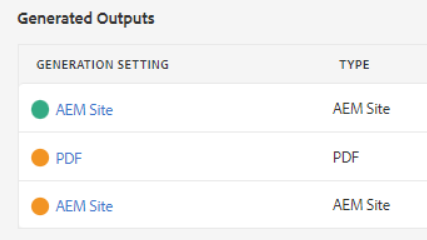

# Fehlerbehebung bei Veröffentlichungsfehlern

Das Veröffentlichen einer Karte ist in der Regel einfach. Öffnen Sie die Zuordnung, wählen Sie eine Ausgabevorgabe aus und generieren Sie eine Ausgabe! Wenn eine Zuordnung oder ihre Themen jedoch Fehler enthalten, kann die Ausgabegenerierung fehlschlagen. In diesem Fall ist es wichtig zu wissen, wie Fehler behoben werden können.

>[!VIDEO](https://video.tv.adobe.com/v/338990?quality=12&learn=on)

## Vorbereitung für die Übung

Beispieldateien für die Übung können hier heruntergeladen werden.

[Übung-Download](assets/exercises/publishing-basic-to-advanced.zip)

## Häufige Ursachen für Veröffentlichungsfehler

Es können Fehler in den Quellinhalt eingeführt werden. Zum Beispiel:

* Falsch benannte Dateipfadreferenz

* Falsch benannter Ordner

* Fehlende Grafik oder Datei

* Falsch konfigurierte Inhaltsreferenz

* Fehlerhafter Querverweis

* Fehler in den Werten für ein Attribut (z. B. eine Zeichenfolge statt einer Zahl)

* Falsche Einrichtung der von [!DNL AEM Guides] verwendeten Komponenten

## Auswirkungen von Fehlern

Ein Fehler kann geringfügig sein und zu einem einfachen Hinweis führen, der Sie darüber informiert, dass eine Datei nicht erfolgreich gepackt wurde, oder so schwerwiegend sein kann, dass es zu einem vollständigen Fehler bei der Generierung der Ausgabe kommt. Auf der Registerkarte „Ausgaben“ werden farbcodierte Symbole angezeigt, um Erfolg, Fehler oder Fehler im Zusammenhang mit der Ausgabegenerierung anzuzeigen.

## Öffnen und Überprüfen von Fehlerprotokollen

Die generierte Protokolldatei kann zur Überprüfung geöffnet werden.

1. Klicken Sie auf **Registerkarte** Ausgaben“ unter „Erzeugte **&quot; auf Datum/Uhrzeit**

   

1. Scrollen Sie durch das Fehlerprotokoll.

## Ein- und Ausblenden von Fehlertypen

Das Fehlerprotokoll zeigt jeden Fehlertyp in einer eindeutigen Farbe an.

1. **Auswählen** oder **deselektieren** alle Fehlertypen, um die Hervorhebung ein- oder auszublenden.

1. Navigieren Sie in Fehlern mithilfe der **Weiter** oder **Zurück**-Schaltflächen (Pfeile).

## Fehler beheben

Je nach Fehlertyp kann die Auflösung einfach oder komplex sein. Sie kann von einem Autor oder einer Autorin im XML-Editor abgeschlossen werden oder erfordert, dass ein Administrator oder eine Administratorin mit [!DNL AEM Guides] arbeitet. Spezifische Korrekturen hängen von dem Fehler, der Auswirkung und Ihren Organisations-Workflows ab.

* Falsch benannte Dateipfadreferenz

      Autoren können den Pfadverweis im Quelldokument aktualisieren.
     
  
* Falsch benannter Ordner

      Autoren können den Ordnernamen aktualisieren oder Dateien nach Bedarf verschieben.
     
  
* Fehlende Grafik oder Datei

      Autoren können eine fehlende Grafik/Datei hochladen, eine Grafik/Datei umbenennen oder eine Grafik/Datei verschieben
     
  
* Falsch konfigurierte Inhaltsreferenz

      Autoren können die Position des referenzierten Inhalts korrigieren oder den Pfad zur Inhaltsreferenz ändern.
     
  
* Fehlerhafter Querverweis

      Autoren können die Position korrigieren, auf die die Querverweise verweisen, oder den Namen oder die Eigenschaften der Zieldatei ändern
     
  
* Fehler in den Werten für ein Attribut (z. B. eine Zeichenfolge statt einer Zahl)

      Autoren können das Attribut auf einen korrekten Wert aktualisieren oder Administratoren können das System aktualisieren, um neue Werte zu unterstützen.
     
  
* Falsche Einrichtung der von [!DNL AEM Guides] verwendeten Komponenten

      Administratoren können die Installation des Systems, seine Komponenten oder Berechtigungen aktualisieren.
     
  