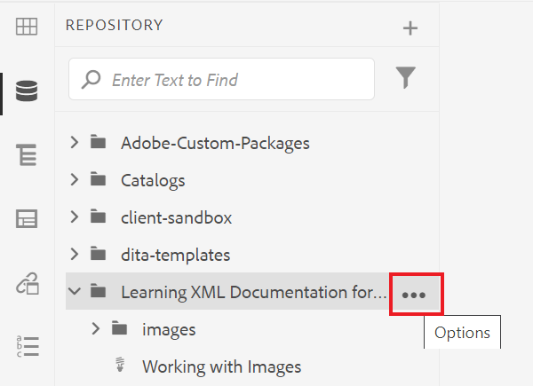

# Arbeiten mit Berichten

Auf der Registerkarte Berichte im Zuordnungs-Dashboard können Sie fehlerhafte Links, referenzierte und wiederverwendete Inhalte (Conrefs), Querverweise oder andere fehlende Informationen identifizieren und auflösen.

>[!VIDEO](https://video.tv.adobe.com/v/339039?quality=12&learn=on)

## Vorbereitung für die Übung

Beispieldateien für die Übung können hier heruntergeladen werden.

[Übung herunterladen](assets/exercises/working-with-reports.zip)

## Hochladen von Assets

1. Wählen Sie in der Repository-Ansicht das Symbol mit den Auslassungspunkten im Hauptordner aus, um das Menü „Optionen“ zu öffnen.

   

1. Wählen **[!UICONTROL Assets hochladen]** aus.

   

1. Wählen Sie die Dateien aus, die Sie in den Ordner hochladen möchten, und wählen Sie **Hochladen**.

Die DITA-Dateien werden geöffnet. Sie sollten sie auf Probleme mit fehlenden Inhalten, Konferenzen oder Querverweisen überprüfen.

## Erstellen einer Zuordnung

1. Wählen Sie das Symbol mit den Auslassungspunkten auf Ihrem Hauptordner aus, um das Menü „Optionen“ zu öffnen.

   

1. Wählen Sie **Erstellen > Zuweisen**.

   

   Das Dialogfeld Neue Zuordnung erstellen wird angezeigt.

1. Wählen Sie im Feld Vorlage **Bookmap** (oder **Map** basierend auf dem Inhaltstyp, den Sie erstellen) aus dem Dropdown-Menü aus und geben Sie Ihrer Zuordnung einen Titel.

1. Wählen Sie **Erstellen** aus.

Ihre Zuordnung wird erstellt und die linke Leiste wechselt automatisch von der Repository-Ansicht zur Zuordnungsansicht.

## Einfügen von Zuordnungskomponenten

1. Wählen Sie das Stiftsymbol in der linken Leiste aus.
Dies ist das Symbol Bearbeiten , über das Sie die Karte im Editor öffnen können.

   

1. Wechseln Sie zurück zur Repository-Ansicht, indem Sie das Repository -Symbol auswählen.

   

1. Fügen Sie der Karte ein Thema hinzu, indem Sie es aus dem Repository auf die Karte im Editor ziehen und ablegen.
Die Zeilenanzeige zeigt an, wo das Thema platziert wird.

1. Fügen Sie weitere Themen hinzu, falls erforderlich.

1. Wenn Sie fertig sind, wählen **Als neue Version speichern.**

   

1. Geben *im Feld „Kommentare für neue Version* einen beschreibenden Kommentar ein.

1. Wählen Sie **Speichern** aus.

## Erstellen einer AEM-Site-Ausgabe

1. Wählen Sie im Repository das Symbol mit den Auslassungspunkten auf Ihrer Zuordnung aus, um das Menü „Optionen“ zu öffnen, und klicken Sie dann auf **Dashboard „Zuordnung öffnen“**

   

   Das Zuordnungs-Dashboard wird auf einer anderen Registerkarte geöffnet.
1. Wählen Sie auf der Registerkarte „Ausgabevorgaben“ **AEM-Site**.

   

1. Wählen Sie **Generieren**.

1. Navigieren Sie zur Seite „Ausgaben“, um den Status Ihrer generierten Ausgaben anzuzeigen.
Wenn Fehler auftreten, wird auf der Registerkarte Ausgaben möglicherweise ein orangefarbener Kreis unter der Spalte Erzeugungseinstellungen anstelle von grün angezeigt, was darauf hinweist, dass die Erstellung abgeschlossen ist.

1. Wählen Sie den Link unter der Spalte Erzeugungseinstellungen aus, um die generierte Ausgabe zu öffnen.
Überprüfen Sie Ihre Ausgabe auf fehlende Inhalte.

## Registerkarte „Berichte“

Auf der Registerkarte Berichte werden eine Themenübersicht und eine Tabelle mit Themeninformationen und den Problemen in Ihrer Zuordnung angezeigt.

Idealerweise sollten Sie die Berichte immer nach dem Import von Inhalten auf eine Zuordnung überprüfen.

Die Spalte Fehlende Elemente gibt die Anzahl der fehlenden Bilder und fehlerhaften Konferenzen an. Sie können auf das **Bleistift**-Symbol klicken, um das Thema im Editor zu öffnen.

## Beheben fehlender Bilder

Wenn in Ihren Dateien Bilder fehlen, kann eine häufige Ursache darin bestehen, dass Inhalte hochgeladen wurden, Bilder jedoch nicht. Wenn ja, beheben Sie die fehlenden Bildprobleme, indem Sie Bilder in einen bestimmten Ordner hochladen, der dem von Dateien erwarteten Pfad und Dateinamen entspricht.

1. Klicken *in der Repository* Ansicht auf das Symbol mit den Auslassungspunkten im Bildordner, um das Menü „Optionen“ zu öffnen.

   

1. Wählen Sie **[!UICONTROL Assets hochladen]** und wählen Sie die fehlenden Bilder aus.

1. Wählen Sie **Hochladen** aus.

Die fehlenden Bilder wurden hochgeladen. Jetzt zeigt eine neu generierte AEM Site-Ausgabe diese Bilder an, und auf der Registerkarte Berichte werden keine fehlenden Bildfehler mehr angezeigt.

## Beheben von fehlerhaften Konferenzen

Wenn Inhalte, auf die an anderer Stelle verwiesen wird (eine conref), für eine Datei in einem anderen Ordner auf verlinkt (z. B. einer mit dem Namen „Wiederverwenden„). und der Inhalt nicht hochgeladen wurde, muss ein Fehler behoben werden. Sie müssen beispielsweise einen Unterordner mit dem Namen „Wiederverwenden“ erstellen und die fehlende Datei in „Wiederverwenden“ hochladen.

### Hochladen eines Assets mit der [!UICONTROL Assets]-Benutzeroberfläche

Zusätzlich zur Option [!UICONTROL Assets hochladen] können Sie Assets hochladen, indem Sie sie auf die Assets-Benutzeroberfläche ziehen und dort ablegen.

1. Klicken Sie in der Repository-Ansicht auf das Symbol mit den Auslassungspunkten im Wiederverwendungs-Ordner, um das Menü „Optionen“ zu öffnen.

   

1. Wählen Sie **In Assets-Benutzeroberfläche anzeigen** aus.

   

1. Ziehen Sie die Datei per Drag-and-Drop in den Ordner .
Die Datei wird hochgeladen, und der conref-Fehler wird behoben.

Alle Fehler wurden behoben. Auf der Seite „Berichte“ wird angezeigt, dass keine Fehler mehr vorliegen, und das Generieren einer AEM-Site führt zu einer vollständigen Ausgabe ohne fehlende Komponenten.
