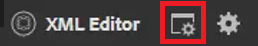

# Bedingungen

In DITA werden Bedingungen oft durch Attribute wie Produkt, Plattform und Zielgruppe gesteuert. Diesen können auch bestimmte Werte zugewiesen werden. Benutzer können all dies über Ordnerprofile steuern.

Beispieldateien, die Sie in dieser Lektion verwenden können, finden Sie in der Datei [conditions.zip](assets/conditions.zip).

>[!VIDEO](https://video.tv.adobe.com/v/342755?quality=12&learn=on)

## Zuweisen von Bedingungen zu einem Ordnerprofil

1. Wählen Sie die **Ordnerprofile** aus.

1. Klicken Sie [!UICONTROL **Bedingte Attribute**].

1. Klicken [!UICONTROL **oben**] Profil auf „Bearbeiten“.

1. Klicken Sie auf [!UICONTROL **Hinzufügen**].

   

1. Füllen Sie die erforderlichen Felder aus.

   - Der Name sollte einem für die Profilerstellung verwendeten Attribut entsprechen.

   - Der Wert ist der exakte Eintrag, der in der DITA-Code-Quelle verwendet wird.

   - Der Titel ist das Wort, das der Benutzer sieht, der Attribute eingibt.

1. Klicken Sie auf [!UICONTROL **Speichern**].

>[!NOTE]
>
>HINWEIS: Die Konfiguration eines globalen Profils kann eine frühe und effiziente Möglichkeit sein, die Verwendung von Attributen und Werten zu steuern und so einem konsistenten Stil-Handbuch zu folgen.

## Zuweisen von Attributen zu Elementen

Wenn einem Konzept kein benutzerdefiniertes Ordnerprofil zugewiesen wurde, können Sie bestimmten Elementen, z. B. Absätzen, Attribute zuweisen.

1. Klicken Sie in **Repository-**) auf das Element, mit dem Sie arbeiten möchten, um es auszuwählen.

1. Klicken Sie im Bedienfeld **Inhaltseigenschaften** auf die [!UICONTROL **Attribut**].

1. Wählen Sie das Attribut aus, das Sie zuweisen möchten.

1. Fügen Sie einen **Wert“**.

Die Attribut- und Wertpaarung sind nun dem ausgewählten Element zugewiesen.

## Zuweisen von Attribut- und Wertpaaren mithilfe von Bedingungen

Das Bedienfeld Bedingungen ermöglicht die kontrollierte Zuweisung von Attribut- und Wert-Paaren.

1. Ändern Sie **Benutzereinstellungen**.

   a. Klicken Sie auf das Symbol Benutzereinstellungen .

   

   b. Füllen Sie die erforderlichen Felder im Dialogfeld **Benutzereinstellungen** aus. Zum Beispiel:

   

   c. Klicken Sie auf [!UICONTROL **Speichern**].

1. Erweitern Sie im Bedienfeld Bedingungen die Dropdown-Listen für Audience und Platform. Beachten Sie, dass die verfügbaren Bedingungen ordnerprofilspezifisch sind.

1. Ziehen Sie eine Bedingung per Drag-and-Drop auf das gewünschte Element, um sie zuzuweisen.

## Zuweisen eines Betreffschemas

Subject Scheme maps sind eine spezielle Form der Imagemap und werden von einer Karte referenziert. Subjektschemata werden verwendet, um Taxonomien zu definieren. Sie ermöglichen die Kontrolle über die verfügbaren Werte.

1. Navigieren Sie zur **Repository-Ansicht**.

1. Wählen Sie eine Zuordnung aus, die auf die Schemadarstellung des Betreffs verweist. In diesem Beispiel wird die Zuordnung namens &quot;_und Layout“_.

   

1. Konfigurieren Sie die Benutzereinstellungen.

   a. Klicken Sie auf [!UICONTROL **Symbol &quot;**]&quot;.

   

   b. Füllen Sie die Felder im Dialogfeld **Benutzereinstellungen** aus.

   c. Klicken Sie auf das Ordnersymbol neben dem Feld Basispfad , um den Pfad zur gewünschten Datei auszuwählen.

   d. Klicken Sie auf [!UICONTROL **Auswählen**].

   e. Klicken Sie auf das Schlüsselsymbol neben dem Feld **Stammzuordnung**, um einen Pfad einzugeben.

   >[!IMPORTANT]
   >
   >Wichtig: Die ausgewählte Stammzuordnung muss die Zuordnung sein, die das Themenschema enthält.

   

   f. Beschränken Sie die angezeigten Assets, indem Sie die Ordner auswählen, die Sie verwenden möchten.

   g. Klicken Sie auf [!UICONTROL **Auswählen**].

   h. Klicken Sie auf [!UICONTROL **Speichern**].

Das Schema wurde nun zugewiesen.

## Anzeigen des Betreffschemas im Bedienfeld „Bedingungen“

1. Navigieren Sie zu **Editor-Einstellungen**.

1. Wählen Sie die **Bedingungen** aus.

1. Aktivieren Sie das Kontrollkästchen **Betreffschema anzeigen im Bedienfeld Bedingungen**
