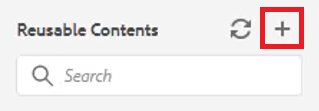

# Inhaltswiederverwendung

Eine der Hauptfunktionen von DITA ist die Möglichkeit, Inhalte wiederzuverwenden. Sie ermöglicht die Wiederverwendung von Inhalten von kleinen Ausdrücken bis hin zu ganzen Themen oder Landkarten.  Damit Inhalte jedoch effektiv wiederverwendet werden können, müssen sie gut verwaltet werden. Stellen Sie sicher, dass Sie beim Arbeiten mit wiederverwendbaren Informationen über eine effektive Inhaltsstrategie verfügen.

>[!VIDEO](https://video.tv.adobe.com/v/342757?quality=12&learn=on)

## Wiederverwendbares Thema erstellen

Wenn an einem wiederverwendbaren Quellthema eine Änderung vorgenommen wird, werden die Informationen überall dort aktualisiert, wo der Inhalt verwendet wird.

1. Navigieren Sie zum **Repository**.

1. Klicken Sie auf das Kontextmenü **neben dem Ordner für die Wiederverwendung.**

1. Wählen Sie **Erstellen > DITA-Thema**.

1. Füllen Sie die Felder im Dialogfeld Neues Thema erstellen aus. Zum Beispiel:

   

1. Klicken Sie auf [!UICONTROL **Erstellen**].

1. Fügen Sie dem Thema nach Bedarf Inhalt hinzu.

## Hinzufügen eines neuen wiederverwendbaren Elements zu einem Thema

Es gibt mehrere Methoden zum Hinzufügen wiederverwendbarer Elemente. Hier ist der erste Workflow am besten, wenn nur eine Komponente hinzugefügt wird. Der zweite Workflow eignet sich besser zum Hinzufügen mehrerer wiederverwendbarer Komponenten.

### Workflow 1

1. Klicken Sie in das Thema an einer gültigen Position.

1. Wählen Sie in der oberen Symbolleiste das Symbol **Wiederverwendbaren Inhalt einfügen** aus.

   

1. Klicken Sie im Dialogfeld &quot;Inhalt wiederverwenden&quot;auf das Symbol [!UICONTROL **Ordner**] .

1. Navigieren Sie zum gewünschten Ordner.

1. Wählen Sie ein Thema mit wiederverwendbaren Komponenten aus.
Zum Beispiel:

   

1. Klicken Sie auf [!UICONTROL **Select**].

1. Wählen Sie eine bestimmte Komponente zur Wiederverwendung aus.

1. Klicken Sie auf [!UICONTROL **Select**].

Das wiederverwendbare Element wurde jetzt in das Thema eingefügt.

### Workflow 2

1. Navigieren Sie im linken Bereich zu **Wiederverwendbaren Inhalt** .

1. Klicken Sie im Bereich Wiederverwendbare Inhalte auf das Symbol [!UICONTROL **Hinzufügen**] .

   

1. Navigieren Sie zu einem Ordner.

1. Wählen Sie ein bestimmtes Thema oder Themen aus.

1. Klicken Sie auf [!UICONTROL **Hinzufügen**].

1. Erweitern Sie im Bereich Wiederverwendbare Inhalte den Eintrag **Elementübersicht**.

1. Ziehen Sie ein Element per Drag-and-Drop in das Thema an einer gültigen Position.

Das wiederverwendbare Element wurde jetzt in das Thema eingefügt.

## Zuweisen einer ID und eines Werts zu einem Element

Der soeben erstellte dlentry ist ein wiederverwendbares Element. Daher sind eine ID und ein Wert erforderlich.

1. Klicken Sie in den Eintrag dlentry.

1. Klicken Sie im Bereich &quot;Inhaltseigenschaften&quot;auf das Dropdown-Menü unter &quot;Attribut&quot;.

1. Wählen Sie **ID** aus.

1. Geben Sie einen logischen Namen für den Wert ein.

1. Speichern oder verändern Sie das Thema, damit die Änderung im Repository angezeigt wird.

Die ID und der Wert wurden dem Element zugewiesen.
