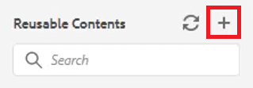

# Wiederverwendung von Inhalten

Eines der Hauptmerkmale von DITA ist die Möglichkeit, Inhalte wiederzuverwenden. Es ermöglicht die Wiederverwendung von Inhalten von kleinen Sätzen bis hin zu ganzen Themen oder Karten.  Damit Inhalte effektiv wiederverwendet werden können, müssen sie jedoch gut verwaltet werden. Stellen Sie sicher, dass Sie beim Arbeiten mit wiederverwendbaren Informationen über eine effektive Inhaltsstrategie verfügen.

>[!VIDEO](https://video.tv.adobe.com/v/342757?quality=12&learn=on)

## Wiederverwendbares Thema erstellen

Wenn eine Änderung an einem wiederverwendbaren Quellthema vorgenommen wird, werden die Informationen überall dort aktualisiert, wo der Inhalt verwendet wird.

1. Navigieren Sie zum **Repository**.

1. Klicken Sie auf **Kontextmenü** neben dem Wiederverwendungs -Ordner.

1. Wählen Sie **Erstellen > DITA-Thema**.

1. Füllen Sie die Felder im Dialogfeld Neues Thema erstellen aus. Beispiel:

   

1. Klicken Sie auf [!UICONTROL **Erstellen**].

1. Fügen Sie dem Thema nach Bedarf Inhalte hinzu.

## Hinzufügen eines neuen wiederverwendbaren Elements zu einem Thema

Es gibt mehrere Methoden zum Hinzufügen wiederverwendbarer Elemente. Hier ist der erste Workflow am besten geeignet, wenn nur eine Komponente hinzugefügt wird. Der zweite Workflow eignet sich besser zum Hinzufügen mehrerer wiederverwendbarer Komponenten.

### Workflow 1

1. Klicken Sie in das Thema an einer gültigen Position.

1. Wählen Sie das **Wiederverwendbaren Inhalt einfügen** in der oberen Symbolleiste aus.

   

1. Klicken Sie im Dialogfeld „Inhalt wiederverwenden“ auf das Symbol [!UICONTROL **Ordner**].

1. Navigieren Sie zum gewünschten Ordner.

1. Wählen Sie ein Thema mit wiederverwendbaren Komponenten.
Beispiel:

   

1. Klicken Sie auf [!UICONTROL **Auswählen**].

1. Wählen Sie eine bestimmte Komponente zur Wiederverwendung aus.

1. Klicken Sie auf [!UICONTROL **Auswählen**].

Das wiederverwendbare Element wurde jetzt in das Thema eingefügt.

### Workflow 2

1. Navigieren Sie **linken Bedienfeld zu** Wiederverwendbarer Inhalt“.

1. Klicken Sie auf [!UICONTROL **Symbol**] Hinzufügen“ im Bedienfeld Wiederverwendbarer Inhalt .

   

1. Navigieren Sie zu einem Ordner.

1. Ein bestimmtes Thema oder bestimmte Themen auswählen.

1. Klicken Sie auf [!UICONTROL **Hinzufügen**].

1. Erweitern Sie im Bedienfeld Wiederverwendbare Inhalte **Elementübersicht**.

1. Ziehen Sie ein Element per Drag-and-Drop an eine gültige Position im Thema.

Das wiederverwendbare Element wurde jetzt in das Thema eingefügt.

## Zuweisen einer ID und eines Werts zu einem Element

Der soeben erstellte Dateneintrag ist ein wiederverwendbares Element. Daher sind eine ID und ein Wert erforderlich.

1. Klicken Sie in die Tür.

1. Klicken Sie im Bedienfeld Inhaltseigenschaften auf das Dropdown-Menü unter „Attribut“.

1. Wählen Sie **ID** aus.

1. Geben Sie einen logischen Namen für den Wert ein.

1. Speichern oder versionieren Sie das Thema, damit die Änderung im Repository übernommen wird.

Die ID und der Wert wurden dem Element zugewiesen.
