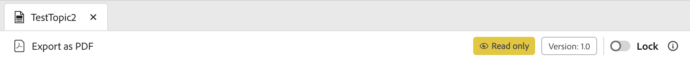

# Überblick

Bei der Migration von der alten Benutzeroberfläche zur neuen AEM Guides-Benutzeroberfläche müssen Aktualisierungen an **ui_config** in flexiblere und modulare Benutzeroberflächenkonfigurationen konvertiert werden. Mit diesem Framework können Änderungen nahtlos in die **editor_toolbar** und [andere Symbolleisten“ ](/help/courses/course-3/conver-ui-config.md#editing-json-for-different-screens) werden. Der Prozess unterstützt auch das Ändern anderer Ansichten und Widgets in der Anwendung.

>[!NOTE]
>
>Anpassungen, die auf bestimmte Schaltflächen angewendet werden, können beim Übergang zum Erweiterungs-Framework Probleme verursachen. In diesem Fall können Sie über diese Seite ein Support-Ticket erstellen, um sofortigen Support und eine schnelle Lösung zu erhalten.

## Bearbeiten von JSON für verschiedene Bildschirme

JSON-Dateien können zum Abschnitt Konfiguration der XML-Editor-Benutzeroberfläche für verschiedene Bildschirme und Widgets hinzugefügt werden. Nachfolgend finden Sie eine Liste häufig verwendeter Widgets und deren IDs:

1. [editor_toolbar](assets/toolbars/editor_toolbar.json): WebEditor-Symbolleiste mit Datei- und Inhaltsaktionen.
1. [editor_tab_bar](assets/toolbars/editor_tab_bar.json): Die Ansicht mit Registerkarten für geöffnete Dateien im Web-Editor verfügt über Aktionen, die Sie für geöffnete Dateien ausführen können.
1. [file_mode_switcher](assets/toolbars/file_mode_switcher.json): Hiermit können Sie für geöffnete Dateien im Web-Editor zwischen verschiedenen verfügbaren Modi (Autor, Quelle, Vorschau) wechseln.

   

1. [map_console_navigation_bar](assets/toolbars/map_console_navigation_bar.json): Dies ist die Informationsleiste für die in der Kartenkonsole geöffnete Karte. Es ermöglicht das Ändern der Zuordnung und bietet Zugriff auf Einstellungen.
1. [map_console_action_bar](assets/toolbars/map_console_action_bar.json): Dies ist die Aktionsleiste für Zuordnungskonsolenelemente wie Ausgabevorgabe, Baseline, Übersetzung und Berichte, die zusammen mit den jeweiligen Aktionsschaltflächen relevante Informationen bereitstellt.

   

1. [home_navigation_bar](assets/toolbars/home_navigation_bar.json): Kopfzeilenleiste der Startseite „Guides“, auf der die Begrüßungsnachricht zusammen mit dem ausgewählten Ordnerprofil angezeigt wird.

   

<br>

## Allgemeine Struktur der einzelnen JSON-Dateien

Jedes JSON folgt einer konsistenten Struktur:

1. `id`: Gibt das Widget an, an das die Komponente angepasst wird.
1. `targetEditor`: Definiert, wann eine Schaltfläche mithilfe der Editor- und Modus-Eigenschaften angezeigt oder ausgeblendet werden soll:

   Die folgenden Optionen werden unter `targetEditor` unterstützt:

   - `mode`
   - `displayMode`
   - `editor`
   - `documentType`
   - `documentSubType`
   - `flag`

   Weitere Informationen finden Sie unter [Grundlegendes zu targetEditor-Eigenschaften](#understanding-targeteditor-properties)

   >[!NOTE]
   >
   > Die Version 2506 von Experience Manager Guides führt neue Eigenschaften ein: `displayMode`, `documentType`, `documentSubType` und `flag`. Diese Eigenschaften werden erst ab Version 2506 unterstützt. Ebenso gilt die Änderung von `toc` in `layout` in der Mode-Eigenschaft ab dieser Version.
   >
   > Das neue Feld `documentType` ist jetzt neben dem vorhandenen Feld `editor` verfügbar.  Beide Felder werden unterstützt und können bei Bedarf verwendet werden. Es wird jedoch empfohlen, `documentType` zu verwenden, um eine konsistente Verwendung über Implementierungen hinweg sicherzustellen, insbesondere bei der Arbeit mit der `documentSubType`-Eigenschaft. Das Feld `editor` bleibt gültig, um die Abwärtskompatibilität und vorhandene Integrationen zu unterstützen.


1. `target`: Gibt an, wo die neue Komponente hinzugefügt wird. Hierbei werden Schlüssel-Wert-Paare oder Indizes zur eindeutigen Identifizierung verwendet. Zu den Ansichtsstatus gehören:

   - **append**: Am Ende hinzufügen.

   - **preend**: Am Anfang hinzufügen.

   - **replace**: Ersetzt eine vorhandene Komponente.

Beispiel für JSON-Struktur:

```json
{
  "id" : "editor_toolbar",
  "view": {
    "items": [
      {
        ...,
        "targetEditor": {
          "mode": [
            "preview"
          ],
          "editor": [
            "xml"
          ]
        },
        "target": {
          "key": "label",
          "value": "Table",
          "viewState": "prepend"
        },
        ...
      },
    ]
  }
}
```

<br>

## Grundlegendes zu `targetEditor`

Nachstehend finden Sie eine Aufschlüsselung der einzelnen Eigenschaften, ihres Zwecks und der unterstützten Werte.

### `mode`

Definiert den Betriebsmodus des Editors.

**Unterstützte Werte**: `author`, `source`, `preview`, `layout` (zuvor `toc`), `split`

### `displayMode` *(optional)*

Steuert die Sichtbarkeit oder Interaktivität von Komponenten der Benutzeroberfläche. Der Standardwert ist auf `show` festgelegt, wenn er nicht angegeben ist.

**Unterstützte Werte**: `show`, `hide`, `enabled`, `disabled`

Zum Beispiel:

```
 {
        "icon": "textBulleted",
        "title": "Custom Insert Bulleted",
        "on-click": "$$AUTHOR_INSERT_REMOVE_BULLETED_LIST",
        "key": "$$AUTHOR_INSERT_REMOVE_BULLETED_LIST",
        "targetEditor": {
          "documentType": [
            "ditamap"
          ],
          "mode": [
            "author"
          ],
          "displayMode": "hide"
        }
      },
```

### `editor`

Gibt den primären Dokumenttyp im Editor an.

**Unterstützte Werte**: `ditamap`, `bookmap`, `subjectScheme`, `xml`, `css`, `translation`, `preset`, `pdf_preset`

### `documentType`

Gibt den primären Dokumenttyp an.

**Unterstützte Werte**: `dita`, `ditamap`, `bookmap`, `subjectScheme`, `css`, `preset`, `ditaval`, `reports`, `baseline`, `translation`, `html`, `markdown`, `conditionPresets`

> Zusätzliche Werte können für bestimmte Anwendungsfälle unterstützt werden.

Zum Beispiel:

```
 {
        "icon": "textNumbered",
        "title": "Custom Numbered List",
        "on-click": "$$AUTHOR_INSERT_REMOVE_NUMBERED_LIST",
        "key": "$$AUTHOR_INSERT_REMOVE_NUMBERED_LIST",
        "targetEditor": {
          "documentType": [
            "dita",
            "ditamap"
          ],
          "mode": [
            "author",
            "source"
          ]

        }
      },
```

### `documentSubType`

Klassifiziert das Dokument weiter nach `documentType`.

- **`preset`**: `pdf`, `html5`, `aemsite`, `nativePDF`, `json`, `custom`, `kb`
- **`dita`**: `topic`, `reference`, `concept`, `glossary`, `task`, `troubleshooting`

> Zusätzliche Werte können für bestimmte Anwendungsfälle unterstützt werden.

Zum Beispiel:

```
 {
        "icon": "rename",
        "title": "Custom Rename",
        "on-click": "$$PUBLISH_PRESETS_RENAME",
        "label": "Custom Rename",
        "key": "$$PUBLISH_PRESETS_RENAME",
        "targetEditor": {
          "documentType": [
            "preset"
          ],
          "documentSubType": [
            "nativePDF",
            "aemsite",
            "json"
          ]

        }
      },
```

### `flag`

Boolesche Indikatoren für den Dokumentstatus oder die Funktionen.

**Unterstützte Werte**: `isOutputGenerated`, `isTemporaryFileDownloadable`, `isPDFDownloadable`, `isLocked`, `isUnlocked`, `isDocumentOpen`

Darüber hinaus können Sie auch ein benutzerdefiniertes Flag in `extensionMap` erstellen, das in `targetEditor` als Flag verwendet wird. `extensionMap` ist hier eine globale Variable, mit der benutzerdefinierte Schlüssel oder beobachtbare Werte hinzugefügt werden.

Zum Beispiel:

```
 {
        "icon": "filePDF",
        "title": "Custom Export pdf",
        "on-click": "$$DOWNLOAD_TOPIC_PDF",
        "key": "$$DOWNLOAD_TOPIC_PDF",
        "targetEditor": {
          "documentType": [
            "markdown"
          ],
          "mode": [
            "preview"
          ],
          "flag": ["isPDFDownloadable"]

        }
      },
```


## Beispiele

Im Folgenden finden Sie ein Beispiel dafür, wie Sie eine Schaltfläche in der Editor-Symbolleiste hinzufügen, löschen oder ersetzen.

### Schaltfläche hinzufügen

Hinzufügen einer neuen Schaltfläche **Benutzerdefinierte Tabelle einfügen** in **editor_toolbar** zum Hinzufügen einer einfachen Tabelle, die nur im Vorschaumodus sichtbar ist.

```json
{
  "id": "editor_toolbar",
  "view": {
    "items": [
      {
        "icon": "table",
        "title": "Insert Custom Table",
        "on-click": {
          "name": "$$AUTHOR_INSERT_ELEMENT",
          "args": [
            "simpletable",
            "table",
            "choicetable"
          ]
        },
        "key": "$$AUTHOR_INSERT_ELEMENT",
        "targetEditor": {
          "mode": [
            "preview"
          ],
        },
        "target": {
          "key": "label",
          "value": "Table",
          "viewState": "prepend"
        }
      }
    ]
  }
}
```


### Löschen einer Schaltfläche

Löschen einer Schaltfläche aus der Symbolleiste. Hier entfernen wir die Schaltfläche Bild hinzufügen aus der Editor-Symbolleiste.

```json
{
  "id": "editor_toolbar",
  "view": {
    "items": [
      {
        "hide": true,
        "target": {
          "key": "label",
          "value": "Image",
          "viewState": "replace"
        }
      }
    ]
  }
}
```

### Ersetzen einer Schaltfläche

Ersetzen der Schaltfläche **Multimedia** in der Symbolleiste durch die Schaltfläche **YouTube** zum Einfügen von Links, die nur im Autorenmodus sichtbar ist.

```json
{
  "id": "editor_toolbar",
  "view": {
    "items": [
      {
        "icon": "s2youtube",
        "title": "Youtube",
        "on-click": {
          "name": "$$AUTHOR_INSERT_ELEMENT",
          "args": "<object data='http://youtube.com'></object>"
        },
        "targetEditor": {
          "mode": [
            "author"
          ]
        },
        "target": {
          "key": "elementId",
          "value": "toolbar-multimedia",
          "viewState": "replace"
        }
      }
    ]
  }
}
```


<br>

### Hinzufügen einer Schaltfläche im Vorschaumodus

Entsprechend dem Design wird die Sichtbarkeit der Schaltfläche für gesperrte und entsperrte (schreibgeschützte) Modi separat verwaltet, um ein klares und kontrolliertes Benutzererlebnis zu gewährleisten. Standardmäßig werden neu hinzugefügte Schaltflächen ausgeblendet, wenn sich die Benutzeroberfläche im schreibgeschützten Modus befindet.
Um eine Schaltfläche im **schreibgeschützten) Modus anzuzeigen** müssen Sie ein Ziel angeben, das sie in einem Symbolleistenunterabschnitt platziert, auf den auch dann zugegriffen werden kann, wenn die Benutzeroberfläche gesperrt ist.
Wenn Sie beispielsweise das Ziel als **Als PDF herunterladen** angeben, können Sie sicherstellen, dass die Schaltfläche im selben Abschnitt wie eine vorhandene sichtbare Schaltfläche angezeigt wird, um sie im entsperrten Modus verfügbar zu machen.

```json
"target": {
  "key": "label",
  "value": "Download as PDF",
  "viewState": "prepend"
}
```

Hinzufügen einer Schaltfläche **Als PDF exportieren** im **Vorschau**-Modus, die sowohl im Sperrmodus als auch im Entsperrmodus angezeigt wird.

```json
{
  "id": "editor_toolbar",
  "view": {
    "items": [
      {
        "icon": "filePDF",
        "title": "Export as PDF",
        "on-click": "$$DOWNLOAD_TOPIC_PDF",
        "key": "$$DOWNLOAD_TOPIC_PDF",
        "targetEditor": {
          "editor": [
            "ditamap",
            "xml"
          ],
          "mode": [
            "preview"
          ]
        },
        "target": {
          "key": "label",
          "value": "Download as PDF",
          "viewState": "prepend"
        }
      },
      {
        "icon": "filePDF",
        "title": "Export as PDF",
        "on-click": "$$DOWNLOAD_TOPIC_PDF",
        "key": "$$DOWNLOAD_TOPIC_PDF",
        "targetEditor": {
          "editor": [
            "ditamap",
            "xml"
          ],
          "mode": [
            "preview"
          ]
        }
      }
    ]
  }
}
```

Das folgende Snippet zeigt die Schaltfläche **Als PDF exportieren** mit dem Sperrszenario.


Die Schaltfläche **Als PDF exportieren** mit dem Entsperrszenario wird auch im folgenden Ausschnitt angezeigt.



### Passen Sie die Optionen an, die im Dropdown-Menü der Editor-Symbolleiste angezeigt werden.

Sie können benutzerdefinierte Optionen im Dropdown-Menü „Menü“ mithilfe der folgenden Beispiele anhängen, ausblenden, ersetzen und hinzufügen.

#### anfügend

Anhängen einer Option im Dropdown-Menü. Hier hängen wir **Benutzerdefinierte Menüschaltfläche** in den Menüoptionen an

```json
{
        "icon": "specialCharacter",
        "title": "Custom menu button",
        "on-click": "$$AUTHOR_INSERT_SYMBOL",
        "targetEditor": {
          "editor": [
            "ditamap"
          ],
          "mode": [
            "author"
          ]
        },
        "target": {
          "key": "label",
          "value": "Version label",
          "viewState": "append"
        }
      }
```

#### Ersetzen

Ersetzen einer in der Dropdown-Liste „Menü“ angezeigten Option. Hier ersetzen wir **Prüfungsaufgabe erstellen** durch **Benutzerdefinierte Menüschaltfläche 3**.

```json
{
        "icon": "specialCharacter",
        "title": "Custom menu button 3",
        "on-click": "$$AUTHOR_INSERT_SYMBOL",
        "target": {
          "key": "label",
          "value": "Create review task",
          "viewState": "replace"
        }

      }
```

#### Verstecken

Ausblenden einer Option, die in der Dropdown-Liste Menü angezeigt wird. Hier wird die Option **Suchen und Ersetzen** aus dem Menü ausgeblendet.

```json
{
        "hide": true,
        "target": {
          "key": "label",
          "value": "Find and replace",
          "viewState": "replace"
        }
      }
```

#### Hinzufügen benutzerdefinierter Optionen im Untermenü

Hinzufügen einer Option im Untermenü innerhalb des Dropdown-Menüs.

```json
{
        "icon": "viewAllTags",
        "title": "Toggle Tags View Goziamasu",
        "key": "AUTHOR_TOGGLE_TAG_VIEW",
        "target": {
          "key": "label",
          "value": "Track changes",
          "viewState": "replace"
        },
        "targetEditor": {
          "documentType": [
            "dita"
          ],
          "mode": [
            "author"
          ]
        }

      }
```

## Hochladen von benutzerdefinierten JSONs

1. Klicken Sie in **Konfiguration des XML** Editors in der **auf** Bearbeiten“.
1. Im Unterabschnitt **Konfiguration der Benutzeroberfläche des XML** Editors wird nun eine Schaltfläche **Hochladen** angezeigt.

   {width="400" height="150"}

1. Sie können auf die geänderte JSON-Datei klicken und sie hochladen. (Die JSON, die hochgeladen werden soll, sollte denselben Namen haben wie die ID des anzupassenden Widgets.)
1. Klicken Sie nach dem Hochladen **Speichern** in der Symbolleiste.

   Für jede hochgeladene Datei können Sie auch **Löschen** die JSON-Datei verwenden, um ihre Anpassung aus der Benutzeroberfläche zu entfernen, oder **Herunterladen**, um sie erneut anzuzeigen oder zu ändern.

   {width="400" height="150"}

<br>


## Hochladen von benutzerdefiniertem CSS

Sie können auch CSS hinzufügen, um das Erscheinungsbild benutzerdefinierter hinzugefügter Schaltflächen oder bereits vorhandener Widgets oder Schaltflächen auf der Benutzeroberfläche anzupassen.

Fügen Sie für eine neu hinzugefügte benutzerdefinierte Schaltfläche eine **ExtraClass** zu einer benutzerdefinierten Schaltfläche oder Komponente innerhalb der JSON hinzu.
Bei einer alten Klasse können Sie auch ein -Element untersuchen und die vorhandenen Klassen ändern.

```json
{
  "icon": "table",
  "title": "Insert Custom Table",
  "extraclass": "custom-css",
  "key": "$$AUTHOR_INSERT_ELEMENT",
  "targetEditor": {
    "mode": [
      "preview"
    ],
  },
  "target": {
    "key": "label",
    "value": "Table",
    "viewState": "prepend"
  }
}
```

1. Klicken Sie in **Konfiguration des XML** Editors in der **auf** Bearbeiten“.
1. Im Unterabschnitt **XML-Editor** Seitenlayout wird nun eine Schaltfläche **Hochladen** angezeigt.

   {width="400" height="150"}

1. Sie können auf das geänderte CSS klicken und es hochladen. (Nur CSS-Dateien werden unterstützt)
1. Klicken Sie nach dem Hochladen **Speichern** in der Symbolleiste.

   Für jede hochgeladene Datei können Sie auch **Löschen** die CSS-Datei verwenden, um ihre Anpassung aus der Benutzeroberfläche zu entfernen, oder **Herunterladen**, um sie erneut anzuzeigen oder zu ändern.

   {width="400" height="150"}


<br>

### Beispiel zum Anpassen von Schaltflächen-CSS

Hier fügen wir eine neue Schaltfläche **Benutzerdefinierte Tabelle einfügen** in **editor_toolbar** hinzu, um eine einfache Tabelle hinzuzufügen, die nur im Vorschaumodus sichtbar ist, und ein benutzerdefiniertes CSS darauf anzuwenden.
Dieses CSS ändert den Hintergrund der Schaltfläche und die Schriftgröße ihres Titels.


```css
#editor_toolbar {
  .custom-css {
    background-color: burlywood;
    font-size: 2rem;  
  }
}
```

```json
{
  "id": "editor_toolbar",
  "view": {
    "items": [
      {
        "icon": "table",
        "title": "Insert Custom Table",
        "extraclass": "custom-css",
        ...
      }
    ]
  }
}
```

<br>

## Schritte zum Konvertieren der Benutzeroberflächenkonfiguration in modulare JSON-Dateien

1. Klicken Sie im Bildschirm Navigation auf das Symbol [!UICONTROL **Tools**].

   

1. Wählen **Guides** im linken Bereich aus.

1. Klicken Sie auf die [!UICONTROL **Ordnerprofile**].

   

1. Ordnerprofil auswählen.

1. Klicken Sie auf die Registerkarte [!UICONTROL **XML**] Editor-Konfiguration“.

1. Sie können auf die Schaltfläche **UI-Konfiguration in JSON**. Dadurch wird das JSON **editor_toolbar** und **map_console_action_bar** generiert, das die in **ui_config** vorgenommenen Änderungen enthält.

   

1. Sie können die beispielhaft generierten JSONs für die [Editor-Symbolleiste](assets/editor_toolbar.json) und [Aktionsleiste der Zuordnungskonsole](assets/map_console_action_bar.json)


>[!NOTE]
>
>Änderungen an den Abschnitten **Symbolleiste** und **topbar** werden in **editor_toolbar** JSON hinzugefügt, die auf der Editor-Seite zu sehen sind. Die Änderungen, die an Schaltflächen im Zusammenhang mit Vorgaben oder Übersetzung in **ui_config** vorgenommen werden, werden zu **map_console_action_bar** json hinzugefügt, das auf der Seite „Map-Konsole“ angezeigt wird.
