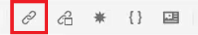

# Querverweise und Links

Der XML-Editor und DITA bieten eine leistungsstarke Möglichkeit, Themen miteinander zu verknüpfen. Es ist wichtig, Ihre Inhaltsreferenzen effektiv zu verwalten, und dazu gehört auch die Arbeit mit eindeutigen ID-Werten.

Beispieldateien, die Sie in dieser Lektion verwenden können, finden Sie in der Datei .
[crossReferencesSandlinks.zip](assets/crossreferencesandlinks.zip)

>[!VIDEO](https://video.tv.adobe.com/v/342764?quality=12&learn=on)

## Erstellen eines Querverweises auf ein externes Thema

Es ist möglich, einen externen Querverweis zu erstellen, indem Sie ein Thema aus dem Repository per Drag-and-Drop in eine geöffnete Datei ziehen. Um jedoch fehlerhafte Querverweise zu vermeiden, muss zunächst eine ID definiert werden, die sich auf einen Wert bezieht, der sich auf das übergeordnete Element bezieht. Dies ist eine einfache Möglichkeit, einen Querverweis zu erstellen und gleichzeitig sicherzustellen, dass IDs korrekt zugewiesen werden.

1. Öffnen Sie eine Datei, in die Sie einen externen Querverweis einfügen möchten.

1. Weisen Sie dem zu referenzierenden Element eine ID zu.

   a. Klicken Sie in das Element.

   b. Wählen Sie im Bedienfeld Inhaltseigenschaften aus der Dropdown **Liste „Attribut** die Option „ID“ aus.

   c. Geben Sie einen logischen Namen in das Feld Wert ein.

   d. Zeigen Sie das Element und seinen Wert bei **in der** an.

1. **Speichern** Sie das Thema, um sicherzustellen, dass das Repository die aktualisierte ID hat.

1. Klicken Sie auf [!UICONTROL **Referenz**]-Symbol in der oberen Symbolleiste.

   

1. Wählen **auf der Registerkarte** Inhaltsreferenz“ die ID- und Elementpaarung aus, die Sie als Querverweis einfügen möchten.

1. Klicken Sie [!UICONTROL **Auswählen**].

Der Querverweis wurde dem Thema hinzugefügt.

## Link zu einer Website

Sie können einen Link zu einer Website innerhalb eines beliebigen Themas einfügen. Weitere Informationen finden Sie im AEM Guides-Kurs-1-Video unter Verknüpfen mit Websites .

## Beschädigte Links anzeigen

Einige Änderungen können zu fehlerhaften Querverweisen führen. Dazu gehören das Löschen eines Themas, die Neuorganisation eines Abschnitts, der einen Querverweis enthält, oder die Änderung einer ID nach dem Einfügen des Querverweises. Beachten Sie, dass ein Beispielthema _crossReferencesSandlinks.zip_ mit dieser Lektion bereitgestellt wird, die dazu führt, dass mehrere der Aufzählungszeichen für interne Inhalte beschädigt werden.

1. Navigieren Sie zur **Gliederungsansicht** im linken Bereich.

1. Klicken Sie auf [!UICONTROL **Filter**]-Symbol.

1. Wählen Sie **Beschädigte Links** aus.

   

Beschädigte Links werden als anklickbare Objekte angezeigt. Sie können sie im Thema in rotem Text identifizieren.
