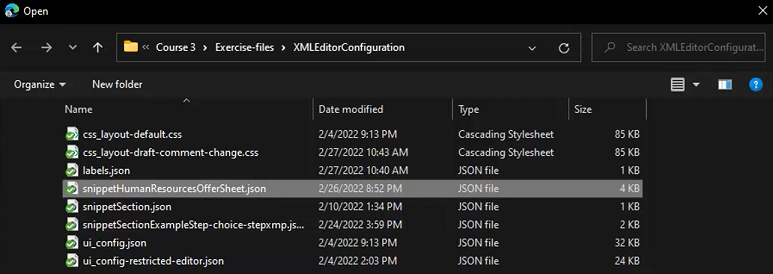

# Konfiguration des XML-Editors

Wenn Sie in einer eingeschränkten Umgebung arbeiten, können Sie festlegen, welche Funktionen Ihre Autoren sehen können, indem Sie die Editor-Konfiguration in einem bestimmten Ordnerprofil anpassen. Durch Anwenden dieses Ordnerprofils können Sie das Erscheinungsbild des Editors selbst, die CSS-Vorlagen, die verfügbaren Snippets und die Inhaltsversionsbeschriftungen ändern.

Beispieldateien, die Sie in dieser Lektion verwenden können, finden Sie in der Datei [xmleditorconfiguration.zip](assets/xmleditorconfiguration.zip).

>[!VIDEO](https://video.tv.adobe.com/v/342762?quality=12&learn=on)

## Anpassen der Standardkonfiguration der Editor-Benutzeroberfläche

Sie können die Standardkonfiguration der Benutzeroberfläche jederzeit auf Ihr lokales System herunterladen, im Texteditor Ihrer Wahl Änderungen daran vornehmen und sie dann erneut hochladen.

1. Klicken Sie im Bildschirm Navigation auf das Symbol [!UICONTROL **Tools**].

   

1. Wählen **Guides** im linken Bereich aus.

1. Klicken Sie auf die [!UICONTROL **Ordnerprofile**].

   

1. Ordnerprofil auswählen.

1. Klicken Sie auf die Registerkarte [!UICONTROL **XML**] Editor-Konfiguration“.

1. Klicken Sie [!UICONTROL **Herunterladen**] Standard.

   

Sie können jetzt den Inhalt in einem Texteditor öffnen und ändern. Das _Handbuch zur Installation und Konfiguration_ AEM Guides enthält Beispiele zum Entfernen, Anpassen oder Hinzufügen von Funktionen zur Benutzeroberflächenkonfiguration.

## Hochladen der geänderten Konfiguration der XML-Editor-Benutzeroberfläche

Nachdem Sie die Benutzeroberflächenkonfiguration angepasst haben, können Sie sie hochladen. Beachten Sie, dass eine Beispielkonfigurationsdatei _ui-config-restrictions-editor.json_ mit den unterstützenden Themen für diese Lektion bereitgestellt wird.

1. Klicken Sie im Ordnerprofil auf die Registerkarte [!UICONTROL **XML-Editor-Konfiguration**] .

1. Klicken Sie unter der Konfiguration der XML-Editor-Benutzeroberfläche auf [!UICONTROL **Hochladen**].

   

1. Doppelklicken Sie auf die Datei für Ihre geänderte UI-Konfiguration oder, wie hier gezeigt, auf die bereitgestellte Beispieldatei.

   

1. Klicken [!UICONTROL **oben links**] Bildschirm auf „Speichern“.

Sie haben die geänderte Benutzeroberflächenkonfiguration erfolgreich hochgeladen.

## Anpassen des CSS-Vorlagenlayouts

Wie bei der UI-Konfiguration können Sie das CSS-Vorlagen-Layout herunterladen. Sie können es in einem Texteditor öffnen und Änderungen vornehmen, um das Erscheinungsbild Ihres Themas anzupassen, bevor Sie es hochladen.

1. Klicken Sie im Bildschirm Navigation auf das Symbol [!UICONTROL **Tools**].

   

1. Wählen **Guides** im linken Bereich aus.

1. Klicken Sie auf die [!UICONTROL **Ordnerprofile**].

   

1. Ordnerprofil auswählen.

1. Klicken Sie auf die Registerkarte [!UICONTROL **XML**] Editor-Konfiguration“.

1. Klicken Sie unter dem CSS-Vorlagen-Layout [!UICONTROL **Herunterladen**].

   

Sie können jetzt den CSS-Inhalt in einem Texteditor ändern und speichern.

## Laden Sie das geänderte CSS-Vorlagenlayout hoch

Nachdem Sie das CSS-Vorlagenlayout angepasst haben, können Sie es hochladen. Beachten Sie, dass eine Beispieldatei _css-layout-ONLY-draft-comment-change.css_ mit den unterstützenden Themen für diese Lektion bereitgestellt wird. Diese Datei enthält nur die Entwurfskommentaränderung, während _css-layout-draft-comment-change.css_ die gesamte Datei ist, die Ihnen zu Test- oder Prüfungszwecken zur Verfügung steht.

1. Klicken Sie im Ordnerprofil auf die Registerkarte [!UICONTROL **XML-Editor-Konfiguration**] .

1. Klicken Sie unter dem CSS-Vorlagenlayout auf [!UICONTROL **Hochladen**].

   

1. Doppelklicken Sie auf die Datei für Ihr eigenes benutzerdefiniertes CSS-Layout oder die bereitgestellte Beispieldatei, die hier angezeigt wird.

   

1. Klicken [!UICONTROL **oben links**] Bildschirm auf „Speichern“.
Sie haben das benutzerdefinierte CSS-Vorlagenlayout erfolgreich hochgeladen.

## Bearbeiten von XML-Editor-Snippets

Snippets sind wiederverwendbare Inhaltselemente, die für ein Produkt oder eine Gruppe spezifisch sein können. Beachten Sie, dass in dieser Lektion Beispiel-Snippets mit den unterstützenden Dateien bereitgestellt werden.

1. Klicken Sie im Bildschirm Navigation auf das Symbol [!UICONTROL **Tools**].

   

1. Wählen **Guides** im linken Bereich aus.

1. Klicken Sie auf die [!UICONTROL **Ordnerprofile**].

   

1. Ordnerprofil auswählen.

1. Klicken Sie auf die Registerkarte [!UICONTROL **XML**] Editor-Konfiguration“.

1. Klicken Sie unter XML-Editor-Snippets auf **Hochladen**.

   

1. Wählen Sie Ihre eigenen Snippets oder verwenden Sie die bereitgestellten Beispiele.

   

1. Klicken [!UICONTROL **oben links**] Bildschirm auf „Speichern“.

Neue Snippets wurden dem Editor hinzugefügt.

## Anpassen von XML-Inhaltsversionskennzeichnungen

Standardmäßig können Autoren Beschriftungen ihrer Wahl erstellen und sie mit Themendateien verknüpfen. Dies kann zu verschiedenen Varianten auf derselben Kennzeichnung führen. Um inkonsistente Beschriftungen zu vermeiden, können Sie auch aus Listen vordefinierter Beschriftungen auswählen.

1. Klicken Sie im Bildschirm Navigation auf das Symbol [!UICONTROL **Tools**].

   

1. Wählen **Guides** im linken Bereich aus.

1. Klicken Sie auf die [!UICONTROL **Ordnerprofile**].

   

1. Ordnerprofil auswählen.

1. Klicken Sie auf die Registerkarte [!UICONTROL **XML**] Editor-Konfiguration“.

1. Klicken Sie unter XML Content Version Labels [!UICONTROL **Download**].

   

Sie können jetzt die Beschriftungen nach Bedarf anpassen.

## Hochladen von XML-Inhaltsversionskennzeichnungen

Nachdem Sie die Kennzeichnungen heruntergeladen und geändert haben, können Sie das Thema „Titel der XML-Inhaltsversion“ hochladen. Sie können auch die Beispieldatei _labels.json_ verwenden, die mit den unterstützenden Themen zu dieser Lektion bereitgestellt wird.

1. Klicken Sie im Ordnerprofil auf die Registerkarte [!UICONTROL **XML-Editor-Konfiguration**] .

1. Klicken Sie unter XML Content Version Labels auf [!UICONTROL **Hochladen**].

   

1. Doppelklicken Sie auf die Datei, um entweder eigene benutzerdefinierte Kennzeichnungen oder die bereitgestellte Beispieldatei anzuzeigen.

   

1. Klicken [!UICONTROL **oben links**] Bildschirm auf „Speichern“.

Sie haben benutzerdefinierte XML-Inhaltsversionskennzeichnungen erfolgreich hochgeladen.
