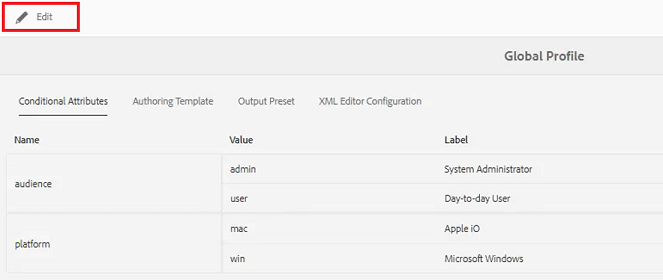
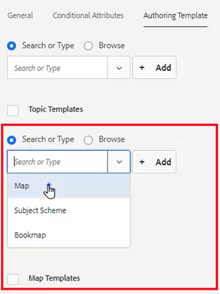

# Ordnerprofile

AEM bietet schnellen Zugriff auf Konfigurations-Tools. Durch die Anpassung von Ordnerprofilen können verschiedene Abteilungen oder Produkte über eindeutige Vorlagen, Authoring-Umgebungen, bedingte Attributprofile, Snippets oder sogar Web-Editor-Konfigurationen verfügen.

Beispieldateien, die Sie in dieser Lektion verwenden können, finden Sie in der Datei &quot;[.zip](assets/folderprofiles.zip).

>[!VIDEO](https://video.tv.adobe.com/v/342758?quality=12&learn=on)

## Zugriff auf Ordnerprofile

Konfigurationen werden über das Symbol Ordnerprofile verwaltet.

1. Klicken Sie im Bildschirm Navigation auf das Symbol [!UICONTROL **Tools**].

   

1. Wählen **Guides** im linken Bereich aus.

1. Klicken Sie auf die [!UICONTROL **Ordnerprofile**].

   

1. Wählen Sie das gewünschte Profil aus. Wählen Sie beispielsweise **Globales Profil**, das das Standardprofil ist.

   

## Bearbeiten von bedingten Attributen im globalen Profil

Nachdem Sie auf das globale Profil zugegriffen haben, können Sie dessen Konfiguration bearbeiten. Die globalen Profileinstellungen werden auf alle Benutzer angewendet, sofern nicht anders angegeben.

1. Wählen Sie im globalen Profil die Registerkarte **Bedingte Attribute** aus.

1. Klicken [!UICONTROL **oben links**] Bildschirm auf „Bearbeiten“.

   

1. Klicken Sie auf [!UICONTROL **Hinzufügen**].

1. Füllen Sie die **Name**, **Value** und **Label** für die neue Bedingung aus.

   

1. Klicken [!UICONTROL **oben links**] Bildschirm auf „Speichern“.
Die neue Bedingung steht nun allen Benutzern zur Verfügung. Sie können sie im Bedienfeld Inhaltseigenschaften auswählen und sie nach Bedarf auf Inhalte anwenden.

## Neues Ordnerprofil erstellen

Zusätzlich zum standardmäßigen globalen Profil können Sie auch eigene benutzerdefinierte Profile erstellen.

1. Klicken Sie im Bildschirm Navigation auf das Symbol [!UICONTROL **Tools**].

   

1. Wählen **Guides** im linken Bereich aus.

1. Klicken Sie auf die [!UICONTROL **Ordnerprofile**].

   

1. Klicken Sie auf [!UICONTROL **Erstellen**].

1. Im Dialogfeld Ordnerprofil erstellen .

   a. Benennen Sie das Profil.

   b. Geben Sie einen Pfad an.

   c. Klicken Sie auf [!UICONTROL **Erstellen**].

   

Eine Kachel mit dem neuen Profilnamen wird auf der Seite Ordnerprofile angezeigt.

## Hinzufügen von administrativen Benutzern über die Registerkarte Allgemein

Administratorbenutzer sind berechtigt, die bedingten Attribute, die Autorenvorlage und die Ausgabevorgaben für das Ordnerprofil zu aktualisieren.

1. Klicken Sie auf die Kachel, um das gewünschte Ordnerprofil zu öffnen.

   

1. Wählen Sie die **Allgemein** aus.

1. Klicken [!UICONTROL **oben links**] Bildschirm auf „Bearbeiten“.

1. Wählen Sie unter „Admin-Benutzer“ entweder einen Benutzer aus der Dropdown-Liste aus oder geben Sie den Namen eines Benutzers ein.

1. Klicken Sie auf [!UICONTROL **Hinzufügen**].

   Sie können bei Bedarf mehrere Admin-Benutzer hinzufügen.

   

1. Klicken [!UICONTROL **oben rechts**] Bildschirm auf „Speichern“, wenn alle Benutzer hinzugefügt wurden.

Administrierende Benutzer sind nun diesem Profil zugewiesen.

## Hinzufügen einer neuen Audience über die Registerkarte Bedingte Attribute .

Nachdem Sie auf das globale Profil zugegriffen haben, können Sie dessen Konfiguration bearbeiten. Die globalen Profileinstellungen werden auf alle Benutzer angewendet, sofern nicht anders angegeben.

1. Wählen Sie im gewünschten Ordnerprofil die Registerkarte **Bedingte Attribute** aus.

1. Klicken [!UICONTROL **oben links**] Bildschirm auf „Bearbeiten“.

   

1. Klicken Sie auf [!UICONTROL **Hinzufügen**].

1. Füllen Sie die **Name**, **Value** und **Label** für die neue Bedingung aus.

   Durch Klicken auf [!UICONTROL **Pluszeichen**] Sie zusätzliche Wert- und Beschriftungspaare für das benannte Attribut hinzufügen.

   

1. Klicken [!UICONTROL **oben links**] Bildschirm auf „Speichern“.

Die neuen bedingten Attribute wurden diesem Profil hinzugefügt.

## Wählen Sie eine Vorlage und eine Zuordnung auf der Registerkarte Authoring-Vorlagen aus

AEM Guides ist mit nativen Authoring-Vorlagen und -Zuordnungen ausgestattet. Sie können sie auf bestimmte Autoren beschränken. Standardmäßig werden die Vorlagen im Assets-Speicherort in einem DITA-Vorlagenordner gespeichert.

1. Wählen Sie im gewünschten Ordnerprofil die Registerkarte Authoring-Vorlagen aus.

1. Klicken Sie oben links im Bildschirm auf Bearbeiten .

1. Fügen Sie eine Zuordnungsvorlage hinzu.

   a. Wählen Sie im Dropdown **Map-** eine Option aus den verfügbaren Karten aus.

   b. Klicken Sie auf [!UICONTROL **Hinzufügen**].

   

1. Hinzufügen einer Themenvorlage.

   a. Wählen Sie im **„Themenvorlagen** eine Option aus den verfügbaren Vorlagen aus.

   

1. Klicken Sie auf [!UICONTROL **Hinzufügen**].

1. Fügen Sie bei Bedarf zusätzliche Themenvorlagen hinzu.

1. Wenn Sie fertig sind [!UICONTROL **klicken Sie oben**] auf dem Bildschirm auf „Speichern“.

Die neuen Authoring-Vorlagen wurden diesem Profil hinzugefügt.

## Löschen nicht wesentlicher Vorgaben auf der Registerkarte „Ausgabevorgaben“

Sie können jede Ausgabevorgabe basierend auf dem Ordnerprofil konfigurieren. Nicht benötigte Ausgabevorgaben sollten entfernt werden.

1. Wählen Sie im gewünschten Ordnerprofil die Registerkarte **Ausgabevorgaben** aus.

1. Aktivieren Sie im linken Bedienfeld die Kontrollkästchen aller nicht erforderlichen Vorgaben.

   

1. Klicken [!UICONTROL **oben links**] Bildschirm auf „Vorgabe löschen“.

1. Klicken Sie im Dialogfeld Vorgabe löschen auf [!UICONTROL **Löschen**].

   

Jetzt werden nur noch die Ausgabevorgaben angezeigt, die verwendet werden.

## Hochladen eines Snippets über die Registerkarte „XML-Editor-Konfiguration“

1. Wählen Sie im gewünschten Ordnerprofil die Registerkarte **XML-Editor-Konfiguration** aus.

1. Klicken Sie unter XML-Editor-Snippets auf [!UICONTROL **Hochladen**].

   

1. Navigieren Sie zu einem zuvor erstellten Snippet.

1. Klicken Sie auf [!UICONTROL **Öffnen**].

1. Klicken [!UICONTROL **oben links**] Bildschirm auf „Speichern“.

Sie haben die Editor-Konfiguration erfolgreich geändert, um Snippets einzuschließen.

## Angeben des Ordnerprofils im Repository

Im Editor können Sie die Ergebnisse der Änderungen sehen, die Sie an den Ordnerprofilen vorgenommen haben.

1. Navigieren Sie **Repository-Ansicht**.

1. Klicken Sie auf den Ordner für den Inhalt, mit dem Sie arbeiten möchten.

1. Klicken Sie auf [!UICONTROL **Symbol**] Benutzereinstellungen“ in der oberen Symbolleiste.

   

1. Wählen Sie im Dialogfeld Benutzereinstellungen den gewünschten Profilordner aus der Dropdown-Liste aus.

   

1. Klicken Sie auf [!UICONTROL **Speichern**].

Sie haben das Ordnerprofil auf Ihren Inhalt angewendet. Wenn Sie jetzt ein neues DITA-Thema erstellen, wird eine eingeschränkte Liste von Thementypen angezeigt, die auf dem Ordnerprofil basiert. Die Zielgruppenbedingung enthält die globalen Einstellungen sowie die für das Ordnerprofil spezifischen Einstellungen. Mit der hochgeladenen Snippet-Datei wurde ein Satz von Standard-Snippets zur Auswahl erstellt. Im Zuordnungs-Dashboard werden die eingeschränkten Ausgabevorgaben angezeigt.
