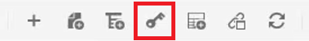
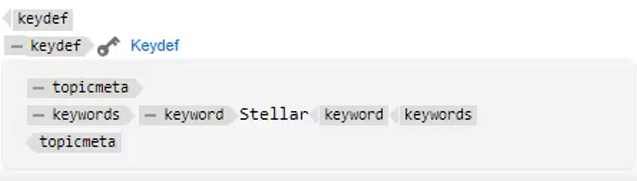

# Schlüssel

Verschiedene Materialsätze können ähnliche Informationen enthalten, die an ausgewählten Orten angepasst werden müssen. Mit Schlüsseln können Sie bei der Arbeit mit DITA Variableninformationen in einfügen.

Beispieldateien, die Sie in dieser Lektion verwenden können, finden Sie in der Datei [keys.zip](assets/keys.zip).

>[!VIDEO](https://video.tv.adobe.com/v/342756?quality=12&learn=on)

## Schlüssel aktivieren

1. Laden Sie den Satz der bereitgestellten Beispieldateien hoch.

   a. Laden Sie die ZIP-Datei.

   b. Aktualisieren Sie die AEM-Umgebung.

   c. Auswahl der zu extrahierenden Datei.

   

   d. Klicken Sie [!UICONTROL **der oberen Symbolleiste auf**] Archiv extrahieren“.

   

   e. Wählen Sie im Dialogfeld den spezifischen Speicherort für zu extrahierende Dateien aus, z. B. den Ordner „Keys“.

   f. Klicken Sie auf [!UICONTROL **Weiter**].

   g. Überspringen Sie alle Konflikte, da sie für Inhalte, die noch nie hochgeladen wurden, nicht existieren werden.

   h. Wählen [!UICONTROL **Extrahieren**] oben rechts im Bildschirm aus.

1. Wenn die Extraktion abgeschlossen ist, klicken Sie auf [!UICONTROL **Zum Zielordner wechseln**].

   

## Schlüssel zu referenzierten Werten auflösen

Um Schlüssel korrekt zu verwenden, müssen Benutzereinstellungen auf eine bestimmte Zuordnung als Stammzuordnung verweisen. Innerhalb dieser Zuordnung befindet sich eine Sammlung von Schlüsseln, die innerhalb einer Themengruppe gruppiert sind. Durch Öffnen der Zuordnung und der Themen werden die Schlüssel zu den Werten aufgelöst, auf die diese Zuordnung verweist.

1. Geben Sie eine Stammzuordnung an.

   a. Öffnen Sie auf dem Bildschirm Schlüssel eine Karte.

   b. Konfigurieren Sie die Benutzereinstellungen.

   c. Klicken Sie auf das [!UICONTROL **Benutzereinstellungen**]-Symbol in der oberen Symbolleiste.

   

   d. Klicken Sie auf das Schlüsselsymbol, um eine **Stammzuordnung** anzugeben, die zum Auflösen von Schlüsseln verwendet wird.

   e. Aktivieren Sie die Kontrollkästchen für jede gewünschte Assets.

   

   f. Klicken Sie auf [!UICONTROL **Auswählen**].

   g. **Speichern** der Benutzereinstellungen.

1. Navigieren Sie zur **Kartenansicht**.

1. Öffnet die angegebene Zuordnung.

Die Schlüssel werden aufgelöst.

## Manuelles Hinzufügen eines neuen Keydef

1. Öffnen Sie eine Zuordnung mit einer angegebenen Stammzuordnung.

1. Schlüssel auswählen.

   

1. Fügen Sie eine neue Keydef ein.

   a. Klicken Sie auf eine gültige Position in der Karte.

   b. Wählen Sie das **Keydef** in der oberen Symbolleiste aus.

   

   c. Geben Sie im Dialogfeld Keydef einfügen einen eindeutigen Wert für Schlüssel ein, der für die Definition, die Sie erstellen, sinnvoll ist.

   d. Klicken Sie auf [!UICONTROL **Einfügen**].

1. Hinzufügen von Themen innerhalb der Keydef.

   a. Klicken Sie auf das [!UICONTROL **Element einfügen**]-Symbol in der oberen Symbolleiste.

   

   b. Suchen Sie im Dialogfeld Element einfügen nach „topicMeta“ und wählen Sie es aus.

1. Fügen Sie Schlüsselwörter innerhalb des Themas hinzu.

   a. Klicken Sie auf das [!UICONTROL **Element einfügen**]-Symbol in der oberen Symbolleiste.

   

   b. Suchen und wählen Sie im Dialogfeld Element einfügen „Keywords“ aus.

1. Fügen Sie ein Keyword innerhalb des TopicMeta hinzu.

   a. Klicken Sie auf das [!UICONTROL **Element einfügen**]-Symbol in der oberen Symbolleiste.

   

   b. Suchen Sie im Dialogfeld **Element einfügen** nach „Keyword“ und wählen Sie diese aus.

1. Geben Sie den Wert für die keydef in das Keyword ein.

In der Karte sollte Ihr Keydef nun in etwa wie folgt aussehen:

## Konfigurieren einer Keydef als Snippet

Snippets sind kleine Inhaltsfragmente, die in verschiedenen Themen in Ihrem Dokumentationsprojekt wiederverwendet werden können. Anstatt jede Keydef manuell zu generieren, können Sie eine einzelne Keydef als Snippet konfigurieren.

1. Ein Keydef-Element in der Zuordnung auswählen.

1. Klicken Sie im Kontextmenü auf [!UICONTROL **Ausschnitt erstellen**].

1. Fügen Sie im Dialogfeld Neues Snippet einen Titel und eine Beschreibung hinzu.
Möglicherweise möchten Sie auch vorhandene Schlüssel oder Schlüsselwortdefinitionen aus dem Inhalt entfernen.

1. Klicken Sie auf [!UICONTROL **Erstellen**].

1. Wählen Sie im linken Bedienfeld die Option **Snippets** aus.

1. Ziehen Sie das soeben erstellte Snippet per Drag-and-Drop aus dem Snippets-Bedienfeld auf die Karte.

1. Aktualisieren Sie die Keydef nach Bedarf mithilfe der Inhaltseigenschaften.
Nach dem Speichern und Aktualisieren ist dieser Schlüsselsatz für alle Benutzenden verfügbar, die eine Zuordnung definiert haben, die dieselbe Stammzuordnung enthält.
