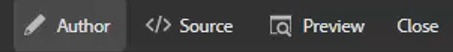
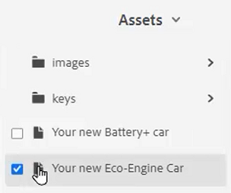

# Schlüssel

Verschiedene Materialgruppen können ähnliche Informationen enthalten, die an ausgewählten Stellen angepasst werden müssen. Schlüssel ermöglichen es Ihnen, bei der Arbeit mit DITA Variableninformationen in einzuschließen.

Beispieldateien, die Sie für diese Lektion verwenden können, finden Sie in der Datei [keys.zip](assets/keys.zip).

>[!VIDEO](https://video.tv.adobe.com/v/342756?quality=12&learn=on)

## Schlüssel aktivieren

1. Laden Sie die bereitgestellten Beispieldateien hoch.

   a. Laden Sie die ZIP-Datei.

   b. Aktualisieren Sie die AEM.

   c. Wählen Sie die zu extrahierende Datei aus.

   

   d. Klicken Sie in der oberen Symbolleiste auf [!UICONTROL **Archiv extrahieren**] .

   

   e. Wählen Sie im Dialogfeld den Speicherort für die zu extrahierenden Dateien aus, z. B. den Ordner Schlüssel .

   f. Klicken Sie auf [!UICONTROL **Weiter**].

   g. Überspringen Sie Konflikte, da sie nicht für Inhalte vorhanden sind, die noch nie hochgeladen wurden.

   h. Wählen Sie oben rechts im Bildschirm [!UICONTROL **Extrahieren**] aus.

1. Wenn der Extrakt abgeschlossen ist, klicken Sie auf [!UICONTROL **Zum Zielordner wechseln**].

   

## Schlüssel zu referenzierten Werten auflösen

Um Schlüssel richtig zu verwenden, müssen Benutzereinstellungen auf eine bestimmte Zuordnung als Stammzuordnung verweisen. Innerhalb dieser Zuordnung befindet sich eine Sammlung von Schlüsseln, die in einer Topicgroup gruppiert sind. Wenn Sie die Zuordnung und die Themen öffnen, werden die Schlüssel zu den Werten aufgelöst, auf die diese Zuordnung verweist.

1. Geben Sie eine Stammzuordnung an.

   a. Öffnen Sie im Bildschirm Schlüssel eine Karte.

   b. Konfigurieren Sie Benutzereinstellungen.

   c. Klicken Sie in der oberen Symbolleiste auf das Symbol [!UICONTROL **Benutzereinstellungen**] .

   

   d. Klicken Sie auf das Schlüsselsymbol, um eine **Stammzuordnung** anzugeben, die zum Auflösen von Schlüsseln verwendet wird.

   e. Aktivieren Sie die Kontrollkästchen für die gewünschte Assets.

   

   f. Klicken Sie auf [!UICONTROL **Select**].

   g. **Speichern** Sie die Benutzereinstellungen.

1. Navigieren Sie zur **Kartenansicht**.

1. Öffnen Sie die angegebene Karte.

Die Schlüssel werden aufgelöst.

## Manuelles Hinzufügen eines neuen Keydefs

1. Öffnen Sie eine Karte mit einer angegebenen Stammzuordnung.

1. Wählen Sie einen Schlüssel aus.

   

1. Fügen Sie ein neues Keydef ein.

   a. Klicken Sie auf eine gültige Position in der Karte.

   b. Wählen Sie in der oberen Symbolleiste das Symbol **Keydef** aus.

   

   c. Geben Sie im Dialogfeld &quot;Keydef einfügen&quot;einen eindeutigen Wert für Schlüssel ein, der für die von Ihnen erstellte Definition sinnvoll ist.

   d. Klicken Sie auf [!UICONTROL **Einfügen**].

1. Fügen Sie topicmeta innerhalb der keydef hinzu.

   a. Klicken Sie in der oberen Symbolleiste auf das Symbol [!UICONTROL **Element einfügen**] .

   

   b. Suchen Sie im Dialogfeld Element einfügen nach &quot;topicmeta&quot;.

1. Fügen Sie Suchbegriffe innerhalb des topicmeta hinzu.

   a. Klicken Sie in der oberen Symbolleiste auf das Symbol [!UICONTROL **Element einfügen**] .

   

   b. Suchen Sie im Dialogfeld Element einfügen nach &quot;Keywords&quot;.

1. Fügen Sie einen Suchbegriff in der topicmeta hinzu.

   a. Klicken Sie in der oberen Symbolleiste auf das Symbol [!UICONTROL **Element einfügen**] .

   

   b. Suchen und wählen Sie im Dialogfeld **Element einfügen** &quot;Keyword&quot;

1. Geben Sie den Wert für den keydef in den Suchbegriff ein.

In der Karte sollte Ihr Keydef jetzt etwa wie folgt aussehen:

## Konfigurieren eines Keydefs als Snippet

Snippets sind kleine Inhaltsfragmente, die in verschiedenen Themen Ihres Dokumentationsprojekts wiederverwendet werden können. Anstatt jede Keydef manuell zu generieren, können Sie eine einzelne Keydef als Snippet konfigurieren.

1. Wählen Sie ein keydef-Element in der Zuordnung aus.

1. Klicken Sie im Kontextmenü auf [!UICONTROL **Snippet erstellen**].

1. Fügen Sie im Dialogfeld Neues Snippet einen Titel und eine Beschreibung hinzu.
Sie können auch vorhandene Schlüssel- oder Suchbegriffdefinitionen aus dem Inhalt entfernen.

1. Klicken Sie auf [!UICONTROL **Erstellen**].

1. Wählen Sie im linken Bereich **Snippets** aus.

1. Ziehen Sie das soeben erstellte Snippet aus dem Bedienfeld &quot;Snippets&quot;in die Karte.

1. Aktualisieren Sie die keydef nach Bedarf mithilfe der Inhaltseigenschaften.
Nach dem Speichern und Aktualisieren ist dieser Satz von Schlüssel für jeden Benutzer verfügbar, der eine Zuordnung definiert hat, die dieselbe Stammzuordnung enthält.
