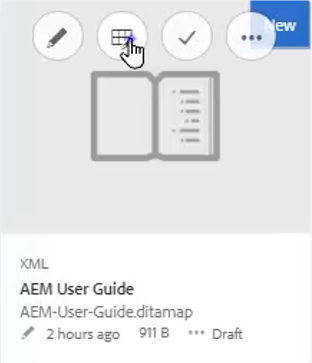
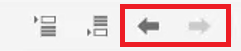
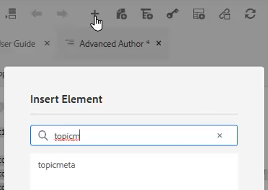
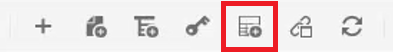
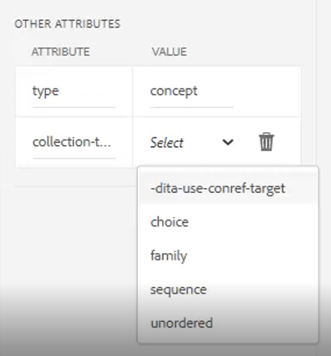

# Karten und Bookmaps

Mit dem Map-Editor von Adobe Experience Manager Guides können Sie Map-Dateien erstellen und bearbeiten. Mit dem Karten-Editor können Sie zwei Arten von Dateien bearbeiten - DITA-Karte und Bookmap. Betrachten Sie diese für unsere Zwecke als weitgehend austauschbare Konzepte.
Der Karten-Editor verfügt über zwei Modi - den einfachen Karten-Editor und den erweiterten Karten-Editor.

>[!VIDEO](https://video.tv.adobe.com/v/342766?quality=12&learn=on)

## Erstellen einer Zuordnung

AEM Guides bietet zwei vordefinierte Kartenvorlagen - DITA-Karte und Bookmap. Sie können auch eigene Zuordnungsvorlagen erstellen und diese für Ihre Autoren freigeben, um Zuordnungsdateien zu erstellen.

Führen Sie die folgenden Schritte aus, um eine Zuordnungsdatei zu erstellen.

1. Navigieren Sie in der Assets-Benutzeroberfläche zu dem Speicherort, an dem Sie die Zuordnungsdatei erstellen möchten.

1. Klicken Sie [!UICONTROL **Erstellen > DITA-Karte**].

1. Wählen Sie auf der Blueprint-Seite den Typ der zu verwendenden Zuordnungsvorlagen aus und klicken Sie auf [!UICONTROL **Weiter**].

1. Geben Sie auf der Seite Eigenschaften einen **Titel** und **Name** für die Zuordnung ein.

1. Klicken Sie auf [!UICONTROL **Erstellen**].

## Öffnen einer Zuordnung mit dem erweiterten Zuordnungs-Editor

1. Wählen Sie in der **Assets** Benutzeroberfläche die Zuordnung aus, die bearbeitet werden soll.

1. Klicken Sie [!UICONTROL **Themen bearbeiten**].

   

oder

1. Bewegen Sie den Mauszeiger über das Zuordnungssymbol.

1. Wählen **Themen bearbeiten** aus dem Menü **Aktion** aus.

## Hinzufügen von Inhalten zu einer Karte oder Lesekarte

1. Navigieren Sie zur **Repository-Ansicht**.

1. Ziehen Sie Inhalte aus der Repository-Ansicht per Drag-and-Drop an gültige Positionen in der Karte oder der Lesekarte.

oder

1. Klicken Sie auf eine gültige Position innerhalb der Karte oder der Lesekarte.

1. Klicken Sie auf [!UICONTROL **entsprechende Symbol der**], um Kapitel, Themen oder Themenreferenzen hinzuzufügen.

   

1. Wählen Sie eine oder mehrere Assets aus, die Sie hinzufügen möchten.

1. Klicken Sie auf [!UICONTROL **Auswählen**].

### Heraufstufen oder Herabstufen von Elementen in einer Zuordnung

Verwenden Sie **Symbolleistenpfeile**, um Kapitel und Themenreferenzen in einer Karte oder Lesekarte hochzustufen oder herabzustufen.

1. Ein Element in der Zuordnung auswählen.

1. Klicken Sie auf den [!UICONTROL **Pfeil nach links**], um eine themenbezogene Ref zu einem Kapitel hochzustufen, oder auf den [!UICONTROL **Pfeil nach rechts**], um ein Kapitel zu einer themenbezogenen Ref zurückzustufen.

   

1. Speichern und versionieren Sie die Zuordnung bei Bedarf.

oder

1. Elemente per Drag-and-Drop verschieben, um sie neu zu organisieren.

## Hinzufügen von Metadaten zu einer Zuordnung

1. Fügen Sie in der **Zuordnungs** Symbolleiste eine Themengruppe ein.

   

1. Klicken Sie auf [!UICONTROL **Plus-Symbol**], um Elemente einzufügen.

1. Einzufügende Elemente auswählen.

   

1. Klicken Sie auf [!UICONTROL **Schließen**].

## Hinzufügen einer Relable zu einer Zuordnung

Nachdem eine Zuordnung strukturiert wurde, kann eine Relable hinzugefügt werden.

1. Klicken Sie in die Karte, in die Sie die Relationstabelle einfügen möchten.

1. Mit dem **Symbolleistensymbol** fügen Sie der Karte das Relable hinzu.

   

1. Konfigurieren Sie das Dialogfeld.

1. Klicken Sie [!UICONTROL **Einfügen**].

1. Ziehen Sie erforderliche Themen per Drag-and-Drop aus dem **Repository** in die Tabelle.

1. Kopieren Sie die erforderlichen Elemente aus der Zuordnung und fügen Sie sie mithilfe von standardmäßigen Tastaturbefehlen in das Relationable ein.

## Zuweisen von Attributen zu TopicRefs in einer Zuordnung

1. Markieren Sie eine TopicRef- oder verschachtelte Sammlung von TopicRefs in der Zuordnung.

1. Wählen Sie unter „Andere Attribute“ im Bedienfeld „Inhaltseigenschaften“ ein **Attribut** und seinen **Wert.**

   
