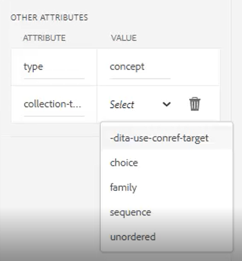

# Karten und Lesekarten

Mit dem Map Editor von Adobe Experience Manager Guides können Sie Zuordnungsdateien erstellen und bearbeiten. Mit dem Map Editor können Sie zwei Arten von Dateien bearbeiten - DITA-Zuordnung und Bookmap. Für unsere Zwecke betrachten sie als weitgehend austauschbare Konzepte.
Der Map Editor ist in zwei Modi verfügbar: den Basic Map Editor und den Advanced Map Editor.

>[!VIDEO](https://video.tv.adobe.com/v/342766?quality=12&learn=on)

## Erstellen einer Karte

AEM Guides bietet zwei vordefinierte Zuordnungsvorlagen - DITA-Zuordnung und Bookmap. Sie können auch eigene Zuordnungsvorlagen erstellen und diese für Ihre Autoren freigeben, um Zuordnungsdateien zu erstellen.

Führen Sie die folgenden Schritte aus, um eine Zuordnungsdatei zu erstellen.

1. Navigieren Sie in der Assets-Benutzeroberfläche zu dem Speicherort, an dem Sie die Zuordnungsdatei erstellen möchten.

1. Klicken Sie auf [!UICONTROL **Erstellen > DITA Map**].

1. Wählen Sie auf der Blueprint-Seite den Typ der zu verwendenden Zuordnungsvorlagen aus und klicken Sie auf [!UICONTROL **Weiter**].

1. Geben Sie auf der Eigenschaftsseite einen **Titel** und einen **Namen** für die Zuordnung ein.

1. Klicken Sie auf [!UICONTROL **Erstellen**].

## Öffnen einer Karte mit dem erweiterten Map-Editor

1. Wählen Sie in der **Assets-Benutzeroberfläche** die zu bearbeitende Zuordnung aus.

1. Klicken Sie auf [!UICONTROL **Themen bearbeiten**].

   

oder

1. Bewegen Sie die Maus über das Kartensymbol.

1. Wählen Sie **Themen bearbeiten** aus dem Menü **Aktion**.

## Hinzufügen von Inhalten zu einer Karte oder Lesekarte

1. Navigieren Sie zur Ansicht &quot;**Repository&quot;**.

1. Ziehen Sie Inhalte aus der Repository-Ansicht an gültige Stellen in der Karte oder der Lesekarte.

oder

1. Klicken Sie auf eine gültige Position in der Karte oder der Lesekarte.

1. Klicken Sie auf das entsprechende Symbol [!UICONTROL **Symbolleiste**], um Kapitel, Themen oder Topicrefs hinzuzufügen.

   

1. Wählen Sie mindestens eine Assets aus, die Sie hinzufügen möchten.

1. Klicken Sie auf [!UICONTROL **Select**].

### Hervorheben oder Demoten von Elementen in einer Zuordnung

Verwenden Sie **Symbolleistenpfeile**, um Kapitel und Topicrefs in einer Karte oder Lesekarte zu bewerben oder zu demotieren.

1. Wählen Sie ein Element in der Zuordnung aus.

1. Klicken Sie auf den Pfeil nach links **], um eine topicref für ein Kapitel zu bewerben, oder auf den Pfeil nach rechts[!UICONTROL **, um ein Kapitel zu einer topicref zu demodieren.[!UICONTROL ****]

   

1. Speichern Sie die Karte und verändern Sie sie bei Bedarf.

oder

1. Ziehen Sie Elemente per Drag-and-Drop in den Arbeitsbereich, um sie neu zu ordnen.

## Hinzufügen von Metadaten zu einer Zuordnung

1. Fügen Sie in der **Symbolleiste &quot;Map&quot;** eine topicgroup ein.

   

1. Klicken Sie auf das Symbol [!UICONTROL **Plus**] , um Elemente einzufügen.

1. Wählen Sie die einzufügenden Elemente aus.

   

1. Klicken Sie auf [!UICONTROL **Schließen**].

## Hinzufügen einer verknüpften Tabelle zu einer Zuordnung

Eine Reltable kann hinzugefügt werden, nachdem eine Zuordnung strukturiert ist.

1. Klicken Sie auf die Karte, in die Sie die entsprechende Tabelle einfügen möchten.

1. Verwenden Sie das Symbol **Symbolleiste** , um die entsprechende Tabelle zur Karte hinzuzufügen.

   

1. Konfigurieren Sie das Dialogfeld.

1. Klicken Sie auf [!UICONTROL **Einfügen**].

1. Ziehen Sie die erforderlichen Themen aus dem **Repository** in die entsprechende Tabelle.

1. Kopieren Sie erforderliche Elemente aus der Zuordnung und fügen Sie sie mithilfe von Standardtastaturkürzeln in die entsprechende Tabelle ein.

## Zuweisen von Attributen zu Topicrefs in einer Zuordnung

1. Markieren Sie eine topicref oder eine verschachtelte Sammlung von topicrefs in der Karte.

1. Wählen Sie unter &quot;Andere Attribute&quot;im Bereich &quot;Inhaltseigenschaften&quot;ein **Attribut** und dessen **Wert** aus.

   
