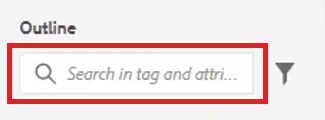

# Gliederungsansicht

Die Gliederungsansicht bietet beim Arbeiten mit einem strukturierten Dokument eine breite Unterstützung. Erweitern und reduzieren Sie die Ansicht, navigieren Sie in der Struktur, arbeiten Sie mit Attributen (z. B. um eine neue ID zu erstellen) und organisieren Sie Elemente per Klick neu, entpacken und strukturieren Sie sie.

>[!VIDEO](https://video.tv.adobe.com/v/342767?quality=12&learn=on)

## Die Gliederungsansicht erweitern und reduzieren

Elemente können erweitert werden, um untergeordnete Elemente anzuzeigen, oder sie können nach Bedarf reduziert werden.

1. Klicken Sie auf das entsprechende Symbol, um die Gliederungsansicht zu erweitern oder zu reduzieren.

   

   

Die Gliederungsansicht wechselt von erweitert zu reduziert.

## Navigieren mithilfe der Gliederungsansicht

1. Klicken Sie auf ein Element, um zu dieser Position zu springen.

1. Klicken Sie auf [!UICONTROL **Auslassungspunkte**] neben einem Element, um auf die Verknüpfungsoptionen zuzugreifen.

   

## Zuweisen einer ID über die Gliederungsansicht

Je nach Systemkonfiguration kann automatisch eine neue ID generiert werden. Mithilfe der Inhaltseigenschaften können die ID und ihr Wert bei Bedarf auch aktualisiert werden.

1. Klicken Sie auf [!UICONTROL **Auslassungspunkte**] neben einem beliebigen Element.

1. Wählen Sie **IDs generieren**.

   

Die ID ist zugewiesen. Die Inhaltseigenschaften werden aktualisiert, und Element- und Attributinformationen werden angezeigt.

## Elemente per Drag &amp; Drop neu organisieren

Elemente können in der Gliederungsansicht neu angeordnet werden.

1. Klicken Sie auf ein Element und ziehen Sie es an eine andere Position in der Gliederungsansicht.

1. Legen Sie das Element auf einem anderen Element ab, um es zu ersetzen. Diese Aktion wird durch ein quadratisches Feld um das zu ersetzende Element angezeigt.

   oder

   Legen Sie das Element zwischen zwei anderen Elementen ab, um seine Position zu ändern. Diese Aktion wird durch eine Linie zwischen den Elementen angezeigt, in denen das neue Element abgelegt wird.

## Umbenennen eines Elements

1. Wählen Sie das Element aus.

1. Klicken Sie auf [!UICONTROL **Auslassungspunkte**].

1. Wählen Sie **Element umbenennen** aus.

   

1. Doppelklicken Sie auf einen neuen Elementnamen.

Das Element wurde jetzt umbenannt.

## Entpacken eines Elements

1. Wählen Sie das Element aus, das Sie entpacken möchten.

1. Klicken Sie auf [!UICONTROL **Auslassungspunkte**].

1. Wählen Sie [!UICONTROL **Element entpacken**] aus.

Der Inhalt bleibt erhalten, aber die Struktur wurde entfernt.

## Filtern von Inhalten mit der Gliederungsansicht

1. Klicken Sie in [!UICONTROL **Gliederungsansicht neben der Suchleiste auf**] Symbol „Filter“.

   

1. Wählen Sie entweder **Alle**, um alle Elemente anzuzeigen, oder **fehlerhafte Links**, um fehlerhafte Verweise zu finden und zu beheben.

## Suche mit Gliederungsansicht

Eine Suche kann eingeschränkt werden und Ergebnisse basierend auf einem Element, einem Attribut oder einem Wert zurückgeben.

1. Geben Sie den Namen des Elements ein, das Sie in der Suchleiste finden möchten.

   

1. Wählen Sie das Ergebnis aus, das für Ihre Anforderungen am relevantesten ist.
