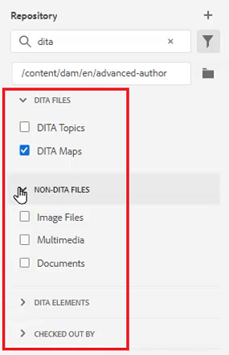
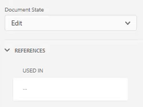

# Bedienfelder

Der AEM Guides-Web-Editor ist in mehrere Abschnitte unterteilt, darunter eine Haupt-Symbolleiste, eine sekundäre Symbolleiste, ein linkes Bedienfeld, ein Inhaltsbearbeitungsbereich und ein rechtes Bedienfeld.

>[!VIDEO](https://video.tv.adobe.com/v/342760?quality=12&learn=on)

## Größe des linken Bedienfelds ändern

Persistente Bedienfelder wie das linke Bedienfeld sind in der Größe anpassbar.

1. Positionieren Sie den Cursor auf dem Rand des Bedienfelds.

1. Wenn der Doppelpfeil angezeigt wird, klicken Sie und ziehen Sie ihn nach Bedarf nach innen oder außen.

## Linke Seitenleiste erweitern oder reduzieren

In der erweiterten Ansicht werden die Namen und Symbole angezeigt, die in der reduzierten Ansicht als QuickInfos angezeigt werden.

1. Klicken Sie auf [!UICONTROL **Seitenleiste**], um das Bedienfeld zu erweitern.

   

1. Klicken Sie erneut auf [!UICONTROL **Seitenleiste**], um das Bedienfeld zu reduzieren.

   

## Erstellen einer Favoritensammlung

Im linken Bereich können Sie mit Favoriten eine Liste bestimmter Dokumente erstellen und im Laufe der Zeit hinzufügen. Sie können eine breite Sammlung von Favoriten erstellen und verwalten.

1. Wählen **im linken** „Favoriten“ aus.

1. Klicken Sie auf das [!UICONTROL **Plus**]-Symbol.

   

1. Geben Sie im Dialogfeld Neue Sammlung einen **Titel** und eine **Beschreibung** ein.

   Beachten Sie, dass durch Auswahl von „Öffentlich“ andere Benutzer diesen Favoriten sehen können.

1. Klicken Sie auf [!UICONTROL **Erstellen**].

Sie haben jetzt eine Favoritensammlung erstellt.

## Hinzufügen einer Datei zu einer Favoritensammlung aus dem Repository

Nachdem Sie eine Sammlung erstellt haben, können Sie damit beginnen, ihr Favoriten hinzuzufügen.

1. Wählen **im linken** „Repository-Ansicht“ aus.

1. Klicken Sie auf [!UICONTROL **Auslassungspunkte**] neben einem Thema, um auf kontextuelle Optionen zuzugreifen.

1. Wählen Sie **Hinzufügen zu** > **Favoriten**.

1. Wählen Sie im Dialogfeld Zu Favoriten hinzufügen die Option **Neue Sammlung** oder **Vorhandene Sammlung**.

   Hier wählen wir das Hinzufügen zu einer vorhandenen Sammlung.

   

1. Wählen Sie bei Bedarf eine Sammlung aus dem Dropdown-Menü aus.

1. Klicken Sie auf [!UICONTROL **Hinzufügen**].

Das Thema wird der ausgewählten Favoritensammlung hinzugefügt. Sie können sie im Menü Favoriten anzeigen.

## Hinzufügen einer Datei zu einer Favoritensammlung über den Editor

Eine weitere Möglichkeit, ein Thema zu Ihren Favoriten hinzuzufügen, besteht darin, ein Thema im Editor zu öffnen.

1. Navigieren Sie zur **Repository-Ansicht**.

1. Doppelklicken Sie auf ein Thema, um es zu öffnen.

1. Klicken Sie im Editor mit der rechten Maustaste auf **Registerkarte „Titel**, um auf kontextuelle Optionen zuzugreifen.

1. Wählen Sie **Hinzufügen zu** > **Favoriten**.

   

1. Wählen Sie im Dialogfeld Zu Favoriten hinzufügen die Option **Neue Sammlung** oder **Vorhandene Sammlung**.

   Hier wählen wir das Hinzufügen zu einer neuen Sammlung.

1. Geben Sie im Dialogfeld Neue Sammlung einen **Titel** und eine **Beschreibung** ein.

   Beachten Sie, dass **Auswahl von**&#x200B;Öffentlich“ bedeutet, dass andere Benutzer diesen Favoriten sehen können.

1. Klicken Sie auf [!UICONTROL **Erstellen**].

Der neue Favorit wurde erstellt und gruppiert. Sie können sie im Menü Favoriten anzeigen.

## Favoriten anzeigen und verwalten

Es ist einfach zu sehen, welche Themen Sie bereits zu Ihren Favoriten hinzugefügt haben.

1. Wählen [!UICONTROL **im linken**] „Favoriten“ aus.

1. Klicken Sie unter Favoriten auf das [!UICONTROL **Pfeil**]-Symbol neben einer Sammlung, um deren Inhalt anzuzeigen.

   

1. Klicken Sie auf [!UICONTROL **Auslassungspunkte**] neben einem Thema, um kontextuelle Optionen aufzurufen, einschließlich der Option, sie aus der Favoritenliste zu löschen.

## Filtern einer Suche in der Repository-Ansicht

Der erweiterte Filter im Repository ermöglicht die Suche nach Text mit einer Vielzahl von Einschränkungen.

1. Navigieren Sie **Repository-Ansicht**.

1. Klicken Sie auf das [!UICONTROL **Suche filtern**].

   

1. Geben Sie Text in den ausgewählten Pfad ein oder wählen Sie ggf. einen neuen Pfad aus.

   Die Liste der Dateien wird aktualisiert, wenn Sie Text in den Filter eingeben.

1. Klicken Sie auf das Pfeilsymbol neben einer Suchkategorie, um die Suche bei Bedarf weiter einzugrenzen.

   

Die Suche kann auf DITA-Themen oder DITA-Maps eingegrenzt werden. Sie können Nicht-DITA-Bilddateien, Multimedia oder andere Dokumente im ausgewählten Pfad suchen. Sie können die Suche auch auf DITA-Elemente beschränken oder nach Auschecken der Datei filtern.

## Erkunden der Kartenansicht

In der Zuordnungsansicht sind mehrere nützliche Funktionen verfügbar, darunter die Möglichkeit zum Auschecken und Sperren von Dateien, zur Vorschau der Zuordnungsdatei, zum Öffnen des Zuordnungs-Dashboards und zum Anzeigen der Zuordnung in der Assets-Benutzeroberfläche.

Weitere Informationen zur Kartenansicht und ihrer Funktionalität finden Sie [ der Lektion ](./maps-and-bookmaps.md)Karten und Bookmaps“ in diesem Kurs.

## Erkunden der Gliederungsansicht

Die Gliederungsansicht bietet eine hierarchische Ansicht des aktuellen Dokuments in der Gliederung. Sie können die Gliederungsansicht erweitern, um mehrere Elemente sowie alle zugewiesenen IDs anzuzeigen.

Weitere Informationen zur Gliederungsansicht und ](./outline-view.md) Funktionen finden Sie in [ Lektion Gliederungsansicht diesem Kurs .

## Arbeiten mit wiederverwendbaren Inhalten

Die zentrale DITA-Funktion ist die Möglichkeit, Inhalte wiederzuverwenden, von kleinen Sätzen bis hin zu ganzen Themen oder Karten. Der Editor bietet eine Drag-and-Drop-Oberfläche für die Wiederverwendung von Inhalten.

Weitere Informationen finden Sie in der Lektion [Wiederverwendung ](./content-reuse.md) Inhalten“ in diesem Kurs .
Informationen zu wiederverwendbaren Inhalten und deren effektiver Verwaltung.

## Arbeiten mit Glossaren

Die Verwendung des Glossars erleichtert die konsistente Formulierung von Informationen und bietet dem Leser mehr Klarheit. Der Editor bietet eine Drag-and-Drop-Oberfläche zum Einfügen von Glossarbegriffen in ein Thema.

Weitere Informationen zur Konfiguration und Verwendung von Glossaren finden [ in ](./glossary.md) Lektion Glossar in diesem Kurs .

## Arbeiten mit Bedingungen

In DITA werden Bedingungen häufig durch die Verwendung von Attributen wie Produkt, Plattform und Zielgruppe gesteuert, denen jeweils bestimmte Werte zugewiesen werden können. Bedingungen werden über Ordnerprofile verwaltet.

Weitere Informationen zur Konfiguration und Verwendung von bedingten Attributen finden [ in ](./conditions.md) Lektion mit dem Titel „Bedingungen“ in diesem Kurs.

## Erstellen eines Snippets

Snippets sind kleine Inhaltsfragmente, die als Ausgangspunkt für Inhalte oder Strukturen wiederverwendet werden können. Die Verwendung von Snippets reduziert den Zeitaufwand für die Erstellung von Inhalten und verbessert die strukturelle Qualität und Konsistenz der Materialien.

1. Öffnen Sie ein Thema im Editor.

1. Element innerhalb des Themas auswählen.

1. Klicken Sie auf die sekundäre Maustaste innerhalb des Elements.

1. Wählen Sie im daraufhin angezeigten Menü die Option Erstellen [!UICONTROL **Snippet**].

   

1. Fügen Sie im Dialogfeld Neues Snippet einen **Titel** und einen **Beschreibung** hinzu.

1. Bearbeiten Sie das Snippet nach Bedarf.

   Beachten Sie, dass eine kontextbezogene Prüfung Sie visuell benachrichtigt, wenn Sie einen Fehler in den Inhalt einführen.

1. Klicken Sie auf [!UICONTROL **Erstellen**].

Der Ausschnitt wird der Liste der verfügbaren Ausschnitte hinzugefügt. Sie kann jetzt per Drag-and-Drop an eine gültige Position im Thema verschoben werden.

## Arbeiten mit Vorlagen

Mithilfe des Bedienfelds Vorlagen können Admins mühelos Vorlagen erstellen und verwalten, die Autorinnen und Autoren verwenden können. Standardmäßig werden Vorlagen als „Zuordnung“ und „Thementyp“ kategorisiert.

Weitere Informationen zum Konfigurieren und Anwenden von Vorlagen finden Sie in den Lektionen [Ordnerprofile](./folder-profiles.md) und [Workflows ](simple-content-creation-workflows.md) Erstellung von Inhalten in diesem Kurs.

## Suchen von Dateien mit „Suchen und Ersetzen“

Im Editor stehen zwei Optionen zum Suchen und Ersetzen zur Verfügung. Die erste ermöglicht Suchen und Ersetzen-Funktionen innerhalb eines bestimmten offenen Themas, ähnlich wie bei einer herkömmlichen Textverarbeitung. Das zweite ist ein Bedienfeld „Suchen und Ersetzen“, das Text in mehreren Dateien im Repository durchsucht.

Weitere Informationen zur Funktion „Suchen [ Ersetzen“ finden Sie ](./spell-check.md) der Lektion „Rechtschreibprüfung und Suchen und Ersetzen“ in diesem Kurs.

## Aktualisieren von Inhaltseigenschaften

Inhaltseigenschaften im rechten Bereich enthalten spezifische Informationen zum aktuell ausgewählten Element, z. B. die Attribut-ID und den Wert.

1. Öffnen Sie ein Thema im **XML-Editor**.

1. Wählen Sie ein **Element** aus.

   Inhaltseigenschaften zeigen den aktuellen Typ und die aktuellen Attribute des Elements an.

1. Geben Sie einen neuen **Wert** für das Element ein.

   

Inhaltseigenschaften werden bei Änderungen an Elementen dynamisch aktualisiert.

## Hinzufügen eines Themas zu einer Zuordnung mithilfe von Dateieigenschaften

In den Dateieigenschaften werden zusätzliche Informationen zum gesamten geöffneten Thema angezeigt. Einige dieser Informationen werden durch Themeneigenschaften gesteuert. Änderungen an anderem Material, z. B. dem Dokumentstatus, können von Berechtigungen abhängen.

1. Öffnen Sie ein Thema im Editor.

1. Klicken Sie auf [!UICONTROL  Symbol **Dateieigenschaften**] im rechten Bedienfeld.

   

1. Setzen Sie den **Dokumentstatus** auf **Bearbeiten**. Beachten Sie, dass die Liste Verweise derzeit leer ist.

   

1. Schließen Sie das Thema.

1. Wählen [!UICONTROL **im linken**] „Repository-Ansicht“ aus.

1. Öffne eine Karte.

   Die Ansicht ändert sich in Kartenansicht.

1. Klicken Sie auf das Symbol [!UICONTROL **Bearbeiten**].

   

1. Sobald die Zuordnung zur Bearbeitung geöffnet ist, wechseln Sie zurück zur **Repository-**.

1. Ziehen Sie das Thema, mit dem Sie arbeiten, per Drag-and-Drop auf die Karte.

1. Klicken Sie auf [!UICONTROL **Speichern**]-Symbol in der oberen Symbolleiste.

Das Thema wird der Karte hinzugefügt. Wenn Sie nun das Thema öffnen und die Dateieigenschaften überprüfen, können Sie sehen, dass die Verweise aktualisiert wurden, um widerzuspiegeln, dass das Thema in der angegebenen Zuordnung verwendet wird.

## Erstellen einer Prüfungsaufgabe

Das rechte Bedienfeld enthält eine Verknüpfung zum Starten eines Überprüfungs-Workflows.

1. Klicken Sie auf [!UICONTROL **Symbol**]&#x200B;Überprüfen“ im rechten Bedienfeld.

   

1. Klicken Sie [!UICONTROL **Create Review**].

   

1. Füllen Sie im Dialogfeld Prüfungsaufgabe erstellen die Felder nach Bedarf aus.

1. Klicken Sie auf [!UICONTROL **Weiter**].

Die Prüfungsaufgabe wird erstellt.

## Änderungen verfolgen

Die Möglichkeit, Änderungen zu verfolgen, gibt Ihnen ein hohes Maß an Kontrolle darüber, welche Änderungen in einer Version eines Themas bis zur nächsten beibehalten werden. Sie können das rechte Bedienfeld verwenden, um verfolgte Änderungen zu verwalten.

Weitere Informationen zur Funktion zur Änderungsverfolgung finden [ in ](./track-changes.md) Lektion mit dem Titel „Änderungen verfolgen“.
