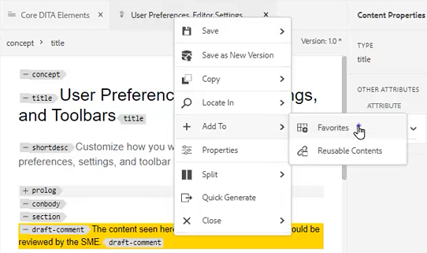
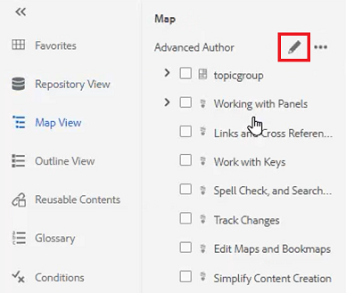

# Bedienfelder

Der AEM Guides Web Editor ist in mehrere Abschnitte unterteilt, darunter eine Hauptsymbolleiste, eine sekundäre Symbolleiste, einen linken Bereich, einen Inhaltsbearbeitungsbereich und einen rechten Bereich.

>[!VIDEO](https://video.tv.adobe.com/v/342760?quality=12&learn=on)

## Größe des linken Bedienfelds ändern

Persistente Bedienfelder wie das linke Bedienfeld sind in der Größe einstellbar.

1. Setzen Sie den Cursor auf den Rand des Bedienfelds.

1. Wenn der Doppelpfeil angezeigt wird, klicken Sie auf und ziehen Sie nach Bedarf nach innen oder außen.

## Erweitern oder Reduzieren der linken Fensterseitenleiste

In der erweiterten Ansicht werden die Namen und Symbole angezeigt, die in der ausgeblendeten Ansicht als QuickInfos angezeigt werden.

1. Klicken Sie auf das Symbol [!UICONTROL **Seitenleiste**] , um das Bedienfeld zu erweitern.

   

1. Klicken Sie erneut auf das Symbol [!UICONTROL **Seitenleiste**] , um das Bedienfeld zu reduzieren.

   

## Erstellen einer Favoritensammlung

Im linken Bereich können Sie mit &quot;Favoriten&quot;eine Liste spezifischer Dokumente erstellen und diese im Laufe der Zeit ergänzen. Sie können eine breite Sammlung von Favoriten erstellen und verwalten.

1. Wählen Sie im linken Bereich **Favoriten** aus.

1. Klicken Sie auf das Symbol [!UICONTROL **Plus**].

   

1. Geben Sie im Dialogfeld &quot;Neue Sammlung&quot;einen **Titel** und eine **Beschreibung** ein.

   Beachten Sie, dass die Auswahl von Öffentlich bedeutet, dass andere Benutzer diesen Favoriten sehen können.

1. Klicken Sie auf [!UICONTROL **Erstellen**].

Sie haben jetzt eine Favoritensammlung erstellt.

## Hinzufügen einer Datei zu einer Favoriten-Sammlung aus dem Repository

Nachdem Sie eine Sammlung erstellt haben, können Sie damit beginnen, ihr Favoriten hinzuzufügen.

1. Wählen Sie im linken Bereich die Option **Repository-Ansicht** aus.

1. Klicken Sie auf die Schaltfläche [!UICONTROL **Auslassungspunkte**] neben einem Thema, um auf kontextbezogene Optionen zuzugreifen.

1. Wählen Sie **Zu** hinzufügen > **Favoriten**.

1. Wählen Sie im Dialogfeld Zu Favoriten hinzufügen die Option **Neue Sammlung** oder **Vorhandene Sammlung**.

   In unserem Beispiel möchten wir einer vorhandenen Sammlung hinzufügen.

   

1. Wählen Sie bei Bedarf eine Sammlung aus der Dropdown-Liste aus.

1. Klicken Sie auf [!UICONTROL **Hinzufügen**].

Das Thema wird der von Ihnen ausgewählten Favoritensammlung hinzugefügt. Sie können sie im Menü Favoriten anzeigen.

## Hinzufügen einer Datei zu einer Favoriten-Sammlung aus dem Editor

Eine weitere Möglichkeit, ein Thema zu Ihren Favoriten hinzuzufügen, ist ein geöffnetes Thema im Editor.

1. Navigieren Sie zur Ansicht &quot;**Repository&quot;**.

1. Doppelklicken Sie auf ein Thema, um es zu öffnen.

1. Klicken Sie im Editor mit der rechten Maustaste auf die Registerkarte **Titel** der Datei, um auf die Kontextoptionen zuzugreifen.

1. Wählen Sie **Zu** hinzufügen > **Favoriten**.

   

1. Wählen Sie im Dialogfeld Zu Favoriten hinzufügen die Option **Neue Sammlung** oder **Vorhandene Sammlung**.

   Hier wählen wir die Hinzufügung zu einer neuen Sammlung.

1. Geben Sie im Dialogfeld &quot;Neue Sammlung&quot;einen **Titel** und eine **Beschreibung** ein.

   Beachten Sie, dass die Auswahl von **Öffentlich** bedeutet, dass andere Benutzer diesen Favoriten sehen können.

1. Klicken Sie auf [!UICONTROL **Erstellen**].

Der neue Favorit wurde erstellt und gruppiert. Sie können sie im Menü Favoriten anzeigen.

## Favoriten anzeigen und verwalten

Es ist einfach anzuzeigen, welche Themen Sie bereits zu Ihren Favoriten-Sammlungen hinzugefügt haben.

1. Wählen Sie im linken Bereich [!UICONTROL **Favoriten**] aus.

1. Klicken Sie unter &quot;Favoriten&quot;auf das Symbol [!UICONTROL **Pfeil**] neben einer Sammlung, um deren Inhalt anzuzeigen.

   

1. Klicken Sie auf die Schaltfläche [!UICONTROL **Auslassungspunkte**] neben einem Thema, um kontextbezogene Optionen anzuzeigen, einschließlich der Option, sie aus der Favoritenliste zu löschen.

## Filtern einer Suche in der Repository-Ansicht

Der erweiterte Filter im Repository ermöglicht die Suche nach Text mit einer Vielzahl von Einschränkungen.

1. Navigieren Sie zu **Repository-Ansicht**.

1. Klicken Sie auf das Symbol [!UICONTROL **Suche filtern**] .

   

1. Geben Sie Text in den ausgewählten Pfad ein oder wählen Sie ggf. einen neuen Pfad aus.

   Die Liste der Dateien wird aktualisiert, wenn Sie Text in den Filter eingeben.

1. Klicken Sie auf das Pfeilsymbol neben einer Suchkategorie, um die Suche bei Bedarf weiter einzuschränken.

   

Die Suche kann auf DITA-Themen oder DITA-Maps beschränkt werden. Im ausgewählten Pfad können Sie nach Nicht-DITA-Bilddateien, Multimedia-Dateien oder anderen Dokumenten suchen. Sie können die Suche sogar auf DITA-Elemente beschränken oder nach Datei-Checkout filtern.

## Landkartenansicht durchsuchen

In der Kartenansicht stehen verschiedene nützliche Funktionen zur Verfügung, darunter die Möglichkeit, Dateien auszuchecken und zu sperren, eine Vorschau der Zuordnungsdatei anzuzeigen, das Zuordnungs-Dashboard zu öffnen und die Zuordnung in der Assets-Benutzeroberfläche anzuzeigen.

Weitere Informationen zur Kartenansicht und ihren Funktionen finden Sie in der Lektion mit dem Titel [Karten und Bookmaps](./maps-and-bookmaps.md) in diesem Kurs.

## Übersicht

Die Gliederung bietet eine hierarchische Ansicht des aktuellen Dokuments in der Gliederung. Sie können die Gliederungsansicht erweitern, um mehrere Elemente sowie zugewiesene IDs anzuzeigen.

In dieser Lektion mit dem Titel [Gliederung anzeigen](./outline-view.md) finden Sie weitere Informationen zur Gliederung und deren Funktionen.

## Verwenden wiederverwendbarer Inhalte

Die DITA-Hauptfunktion ist die Möglichkeit, Inhalte wiederzuverwenden, von kleinen Ausdrücken bis hin zu ganzen Themen oder Karten. Der Editor bietet eine Drag &amp; Drop-Benutzeroberfläche für die Wiederverwendung von Inhalten.

Weitere Informationen finden Sie in der Lektion [Wiederverwendung von Inhalten](./content-reuse.md) in diesem Kurs
Informationen über wiederverwendbare Inhalte und deren effektive Verwaltung.

## Arbeiten mit Glossaren

Die Verwendung des Glossars erleichtert es, Informationen konsistent zu formulieren und dem Leser mehr Klarheit zu verschaffen. Der Editor bietet eine Drag &amp; Drop-Oberfläche zum Einfügen von Glossarbegriffen in ein Thema.

Weitere Informationen zur Konfiguration und Verwendung von Glossaren finden Sie in der Lektion mit dem Titel [Glossar](./glossary.md) in diesem Kurs.

## Arbeiten mit Bedingungen

In DITA werden Bedingungen häufig durch die Verwendung von Attributen wie Produkt, Plattform und Zielgruppe gesteuert, denen jeweils spezifische Werte zugewiesen werden können. Bedingungen werden über Ordnerprofile verwaltet.

Weitere Informationen zum Konfigurieren und Verwenden von bedingten Attributen finden Sie in der Lektion mit dem Titel [Bedingungen](./conditions.md) in diesem Kurs.

## Snippet erstellen

Snippets sind kleine Inhaltsfragmente, die als Ausgangspunkt für Inhalte oder Strukturen wiederverwendet werden können. Die Verwendung von Snippets verringert die Zeit, die zum Erstellen von Inhalten erforderlich ist, und verbessert die strukturelle Qualität und Konsistenz der Materialien.

1. Öffnen Sie ein Thema im Editor.

1. Wählen Sie ein Element im Thema aus.

1. Klicken Sie auf die sekundäre Maustaste innerhalb des Elements.

1. Wählen Sie im resultierenden Menü die Option [!UICONTROL **Snippet**] erstellen.

   

1. Fügen Sie im Dialogfeld &quot;Neues Snippet&quot;einen **Titel** und eine **Beschreibung** hinzu.

1. Bearbeiten Sie den Snippet nach Bedarf.

   Beachten Sie, dass eine Kontextuelle Prüfung Sie visuell benachrichtigt, wenn Sie einen Fehler in den Inhalt einfügen.

1. Klicken Sie auf [!UICONTROL **Erstellen**].

Das Snippet wird zur Liste der verfügbaren Snippets hinzugefügt. Sie können sie per Drag-and-Drop an eine gültige Position im Thema ziehen.

## Arbeiten mit Vorlagen

Im Bereich &quot;Vorlagen&quot;können Administratoren Vorlagen für Autoren einfach erstellen und verwalten. Standardmäßig werden Vorlagen als Zuordnung und Thementyp kategorisiert.

Weiterführende Informationen zum Konfigurieren und Anwenden von Vorlagen finden Sie in den Lektionen [Ordnerprofile](./folder-profiles.md) und [Workflows zur einfachen Inhaltserstellung](simple-content-creation-workflows.md) in diesem Kurs.

## Suchen von Dateien mit Suchen und Ersetzen

Im Editor stehen zwei Optionen zum Suchen und Ersetzen zur Verfügung. Das erste erlaubt Suchen und Ersetzen Funktionen innerhalb eines bestimmten offenen Themas, ähnlich wie ein herkömmlicher Textverarbeitungsprogramm. Das zweite ist ein Bereich &quot;Suchen und Ersetzen&quot;, der Text in mehreren Dateien im Repository durchsucht.

Weitere Informationen zur Funktion &quot;Suchen und Ersetzen&quot;finden Sie in der Lektion mit dem Titel [Rechtschreibprüfung und Suchen und Ersetzen](./spell-check.md) in diesem Kurs.

## Inhaltseigenschaften aktualisieren

Inhaltseigenschaften im rechten Bereich enthalten spezifische Informationen zum aktuell ausgewählten Element, z. B. die Attribut-ID und den Wert.

1. Öffnen Sie ein Thema im **XML-Editor**.

1. Wählen Sie ein **element** aus.

   Inhaltseigenschaften zeigen den aktuellen Typ und die aktuellen Attribute des Elements an.

1. Geben Sie einen neuen **Wert** für das Element ein.

   

Inhaltseigenschaften werden dynamisch aktualisiert, wenn Sie Änderungen an Elementen vornehmen.

## Thema mithilfe der Dateieigenschaften zu einer Zuordnung hinzufügen

Dateieigenschaften zeigen zusätzliche Informationen zum gesamten geöffneten Thema an. Einige dieser Informationen werden durch Themeneigenschaften gesteuert. Änderungen an anderen Materialien, wie z. B. dem Dokumentstatus, können von Berechtigungen abhängen.

1. Öffnen Sie ein Thema im Editor.

1. Klicken Sie im rechten Bereich auf das Symbol [!UICONTROL  **Dateieigenschaften**] .

   

1. Stellen Sie den Dokumentstatus **auf** Bearbeiten **ein.** Beachten Sie, dass die Liste &quot;Verweise&quot;derzeit leer ist.

   

1. Schließen Sie das Thema.

1. Wählen Sie im linken Bereich die Option [!UICONTROL **Repository-Ansicht**] aus.

1. Öffnen Sie eine Karte.

   Die Ansicht ändert sich in Kartenansicht.

1. Klicken Sie auf das Symbol [!UICONTROL **Bearbeiten**].

   

1. Sobald die Zuordnung zur Bearbeitung geöffnet ist, wechseln Sie zurück zur **Repository-Ansicht**.

1. Ziehen Sie das Thema, mit dem Sie arbeiten, in die Karte.

1. Klicken Sie in der oberen Symbolleiste auf das Symbol [!UICONTROL **Speichern**] .

Das Thema wird der Karte hinzugefügt. Wenn Sie jetzt das Thema öffnen und die Dateieigenschaften überprüfen, sehen Sie, dass die Verweise aktualisiert werden, um zu zeigen, dass das Thema in der angegebenen Zuordnung verwendet wird.

## Erstellen einer Prüfungsaufgabe

Das rechte Bedienfeld enthält eine Verknüpfung zum Starten eines Prüfungs-Workflows.

1. Klicken Sie auf das Symbol [!UICONTROL **Überprüfen**] im rechten Bereich.

   

1. Klicken Sie auf [!UICONTROL **Review erstellen**].

   

1. Füllen Sie die Felder im Dialogfeld Prüfungsaufgabe erstellen nach Bedarf aus.

1. Klicken Sie auf [!UICONTROL **Weiter**].

Die Überprüfungsaufgabe wird erstellt.

## Änderungen verfolgen

Durch die Möglichkeit, Änderungen zu verfolgen, haben Sie eine große Kontrolle darüber, welche Änderungen in einer Version eines Themas bis zur nächsten beibehalten werden. Sie können das rechte Bedienfeld verwenden, um getrackte Änderungen zu verwalten.

Weiterführende Informationen zur Änderungsverfolgungsfunktion finden Sie in der Lektion mit dem Titel [Änderungen verfolgen](./track-changes.md) in diesem Kurs.
