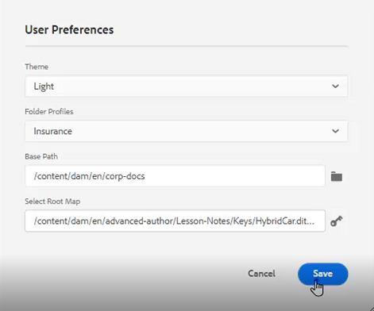

# Einfache Workflows zur Inhaltserstellung

Der AEM Guides-Editor verfügt über mehrere Tastaturbefehle, die den Arbeitsablauf für die Inhaltserstellung vereinfachen. Mithilfe dieser Tastaturbefehle können Benutzende schnell Bilder hinzufügen und ändern, mit mehreren Themen gleichzeitig arbeiten, Fehler korrigieren, Themenversionen herunterladen sowie mit PDF und Beschriftungen arbeiten.

>[!VIDEO](https://video.tv.adobe.com/v/342770?quality=12&learn=on)

## Bild hinzufügen

Bilder können direkt von einem lokalen Laufwerk hinzugefügt werden.

1. Ziehen Sie das Bild direkt in das Thema. Das **Assets hochladen** wird angezeigt.

   

1. Ändern Sie den Ordnerpfad zum gewünschten Bildspeicherort.

1. Ändern Sie den Bildnamen in einen für den Zweck repräsentativen Namen.

1. Klicken Sie auf [!UICONTROL **Hochladen**].

## Ändern eines Bildes

1. Ändern der Größe eines Bildes durch Ziehen und Ablegen einer Ecke.

1. Verschieben eines Bildes an eine andere Position innerhalb des Themas durch Ziehen und Ablegen.

1. Verwenden **Inhaltseigenschaften** im rechten Seitenbereich, um die Eigenschaften eines Bildes zu ändern.

   - Skala

   - position

   - Ausrichtung oder

   - Andere Attribute.

   

## Arbeiten mit mehreren Themen

Die geteilte Ansicht ist hilfreich, wenn Sie Themen vergleichen, Themen kopieren und einfügen oder Inhalte von einem Thema zum anderen ziehen und ablegen möchten.

1. Öffnen Sie zwei oder mehr verwandte Themen.

1. Klicken Sie auf die Registerkarte Titel einer Datei, um das Kontextmenü zu öffnen.

1. Wählen Sie [!UICONTROL **Aufspaltung**] aus.

1. Wählen Sie **Rechts**.

   

## Korrektur von typografischen Fehlern

1. Suchen Sie das Wort oder die Phrase, das/die den Fehler enthält.

1. Drücken und halten Sie [!UICONTROL **Strg**].

1. Klicken Sie auf die sekundäre Maustaste, um den Fehler zu beheben.

1. Wählen Sie die richtige Schreibweise aus.

Der Fehler wurde im Thementext korrigiert.

## Topic-PDF herunterladen

Benutzende können eine PDF des aktuellen Themas herunterladen, um es zu markieren oder mit anderen zu teilen.

1. Klicken [!UICONTROL **oben**] auf dem Bildschirm auf „Vorschau“.

1. Klicken Sie auf das Symbol [!UICONTROL **PDF**] oberhalb des Themas. Ein Dialogfeld wird angezeigt.

   

1. Füllen Sie bei Bedarf die Informationen für **Umwandlungsname** oder **DITA-OT** Befehlszeilenargumente aus. Beachten Sie, dass eine PDF immer noch generiert wird, wenn alle Felder leer gelassen werden.

1. Klicken Sie auf [!UICONTROL **Herunterladen**]. Die PDF erzeugt.

1. Verwenden Sie verfügbare Symbole, um das PDF-Thema zu konfigurieren, herunterzuladen oder freizugeben.

## Suchen eines Themas im Repository oder in der Zuordnung

1. Öffnen Sie das Thema.

1. Klicken Sie auf die zweite Maustaste auf der Registerkarte Titel .

1. Wählen Sie **Suchen in** aus.

1. Wählen Sie entweder **Repository** oder **Map**, um zum gewünschten Themenort zu springen.

## Versionieren eines Themas

1. Ändern eines Themas

1. Speichern Sie das Thema.

1. Klicken Sie auf **Repository**-Symbol oben links im Menü.

   

1. Fügen Sie im Dialogfeld &quot;**für neue Version“**.

   

1. Klicken Sie auf [!UICONTROL **Speichern**].

Die Versionsnummer wird aktualisiert.

## Versionsbezeichnungen laden

Es kann schwierig sein, den Status eines Themas nur anhand der Versionsnummer zu verfolgen. Beschriftungen erleichtern die Identifizierung des genauen Status eines Themas, das mehrfach überarbeitet wurde.

1. Wählen Sie ein **Ordnerprofil** aus.

1. Konfigurieren Sie im Ordnerprofil den XML-Editor.

   a. Wählen Sie Bearbeiten oben links im Bildschirm aus.

   b. Fügen Sie unter XML Content Version Labels entweder ein neues Thema hinzu oder verwenden Sie ein vorhandenes.

   

1. Wählen Sie [!UICONTROL **Hochladen**] aus.

1. Wählen Sie eine Datei wie ReviewLabels.json oder Ähnliches. Details zum Erstellen einer solchen Datei finden Sie in einem anderen Video.

1. Klicken Sie auf [!UICONTROL **Öffnen**].

1. Klicken [!UICONTROL **oben links**] Bildschirm Ordnerprofil auf „Speichern“.

1. Klicken [!UICONTROL **oben**] auf „Schließen“.

Versionsbezeichnungen werden jetzt geladen.

## Zuweisen von Versionskennzeichnungen

1. Versionsbezeichnungen laden.

1. Klicken Sie [!UICONTROL **oben links im aktuellen Thema auf**] Symbol „Benutzereinstellungen“.

   

1. Wählen Sie denselben Profilordner aus, in den die Versionsbezeichnungen zuvor geladen wurden.

1. Stellen Sie im Dialogfeld Benutzereinstellungen sicher, dass der Basispfad auf dieselben Informationen verweist, auf die das Ordnerprofil angewendet wurde.

   

1. Klicken Sie auf [!UICONTROL **Speichern**].

1. Version des Themas.

1. Fügen Sie einen Kommentar hinzu und wählen Sie im Dropdown-Menü eine Versionsbezeichnung aus.

   

1. Klicken Sie auf [!UICONTROL **Speichern**].

Die Versionsnummer wird aktualisiert.

## Anzeigen des Versionsverlaufs und von Kennzeichnungen

1. Suchen Sie im linken Bereich den Titel des aktuellen Themas.

1. Klicken Sie auf den Titel, um das Kontextmenü zu öffnen.

1. Wählen Sie [!UICONTROL **In Assets-Benutzeroberfläche anzeigen**] aus.

   

   - Der Versionsverlauf mit Kennzeichnungen wird auf der linken Seite angezeigt.

   

1. Klicken Sie auf eine Version, um auf Optionen wie **Auf diese Version zurücksetzen** und **Vorschauversion** zuzugreifen.

## Erstellen einer neuen Vorlage

Es gibt Vorlagen für beide Themen und Karten. Administratoren können im linken Bereich auf Vorlagen zugreifen.

1. Klicken Sie [!UICONTROL **linken**] auf „Vorlagen“.

1. Wählen Sie entweder Zuordnung oder Thema aus, um das zugehörige Kontextmenü zu öffnen.

1. Klicken Sie, um die neue Vorlage hinzuzufügen.

   

1. Füllen Sie die Felder im erscheinenden Dialogfeld aus.

Die Shell-Vorlage wird angezeigt, die Beispielinhalte und eine Beispielstruktur enthält.
