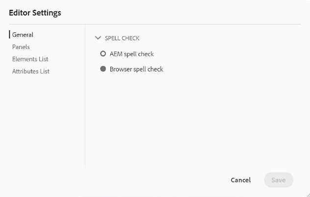
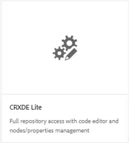
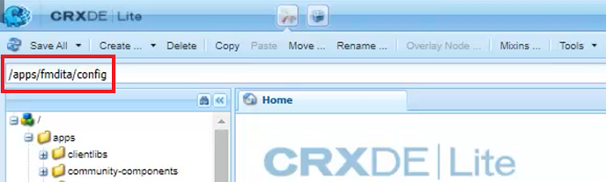
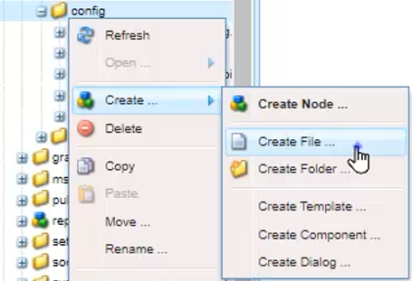
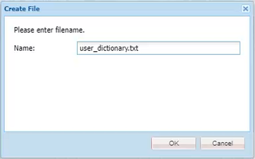
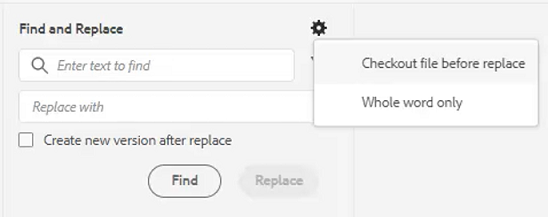
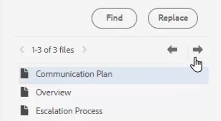

# Rechtschreibprüfung und Suchen/Ersetzen

Der AEM Guides-Editor bietet leistungsstarke Funktionen zum Überprüfen und Ersetzen von Rechtschreibprüfungen.

>[!VIDEO](https://video.tv.adobe.com/v/342768?quality=12&learn=on)

Korrigieren eines Rechtschreibfehlers

1. Suchen Sie einen Fehler in einem offenen Thema, das mit einer roten Unterstreichung angezeigt wird.

1. Drücken und halten Sie Strg + klicken Sie auf die sekundäre Maustaste in dem Wort.

1. Wählen Sie die richtige Schreibweise aus den Vorschlägen aus.

Wenn die richtige Schreibweise nicht empfohlen wird, können Sie das Wort jederzeit manuell bearbeiten.

## Zur AEM-Rechtschreibprüfung wechseln

Sie können auch ein anderes Tool zur Rechtschreibprüfung als das Standardwörterbuch des Browsers verwenden.

1. Navigieren Sie zu **Editor-Einstellungen**.

1. Wählen Sie die **Allgemein** Einstellungen .

   

1. Es gibt zwei Möglichkeiten:

   - **Rechtschreibprüfung des Browsers** - Die Standardeinstellung, bei der die Rechtschreibprüfung das integrierte Wörterbuch des Browsers verwendet.

   - **AEM-Rechtschreibprüfung** - Verwenden Sie diese Option, um eine benutzerdefinierte Wortliste mit dem benutzerdefinierten Wörterbuch von AEM zu erstellen.

1. **AEM-Rechtschreibprüfung**.

1. Klicken Sie auf [!UICONTROL **Speichern**].

Konfigurieren eines benutzerdefinierten Wörterbuchs

Der Administrator kann die Einstellungen ändern, sodass das AEM-Wörterbuch benutzerdefinierte Wörter wie Firmennamen erkennt.

1. Navigieren Sie zum Bereich **Tools** .

1. Anmelden bei **CRXDE Lite**.

   

1. Navigieren Sie zum Knoten **_/apps/fmdita/config_**.

   

1. Erstellen Sie eine neue Datei.

   a. Klicken Sie mit der rechten Maustaste auf den Konfigurationsordner.

   B. Wählen Sie **Erstellen > Datei erstellen**.

   

   C. Benennen Sie die Datei _**user_dictionary.txt**_.

   

   d. Klicken Sie auf [!UICONTROL **OK**].

1. Öffnen Sie die Datei .

1. Fügen Sie eine Liste mit Wörtern hinzu, die Sie in Ihr benutzerdefiniertes Wörterbuch aufnehmen möchten.

1. Klicken Sie auf [!UICONTROL **Alle speichern**].

1. Schließen Sie die Datei .

Autorinnen und Autoren müssen möglicherweise ihre Web-Editor-Sitzung neu starten, um die aktualisierte benutzerdefinierte Wortliste im AEM Dictionary zu erhalten.

## Suchen und Ersetzen in einer Datei

1. Klicken Sie in der oberen Symbolleiste auf Suchen und Ersetzen .

   

1. Geben Sie in der unteren Symbolleiste ein Wort oder einen Satz ein.

1. Klicken Sie auf [!UICONTROL **Suchen**].

1. Geben Sie bei Bedarf ein Wort ein, um das gefundene Wort zu ersetzen.

1. Klicken Sie [!UICONTROL **Ersetzen**].

## Suchen und Ersetzen im gesamten Repository

1. Navigieren Sie zum **Repository**.

1. Klicken Sie auf [!UICONTROL **Symbol „Suchen und Ersetzen**] unten links im Bildschirm.

1. Klicken Sie auf das [!UICONTROL **Einstellungen anzeigen**]-Symbol.

1. Wählen Sie entweder

   - **Datei vor dem Ersetzen auschecken** - Wenn diese Option von einem Administrator aktiviert wurde, wird die Datei vor dem Ersetzen von Suchbegriffen automatisch ausgecheckt.

   - **Nur ganzes Wort** - schränkt die Suche ein, sodass nur das eingegebene Wort oder die eingegebene Phrase zurückgegeben wird.

   

1. Klicken Sie auf [!UICONTROL **Symbol**] Filter anwenden“, um den Pfad im Repository auszuwählen, in dem Sie die Suche durchführen möchten.

1. Geben Sie die Begriffe zum Suchen und Ersetzen ein.

1. Wählen Sie bei Bedarf **Neue Version nach Ersetzen erstellen** aus.

1. Klicken Sie auf [!UICONTROL **Suchen**].

1. Öffnen Sie die gewünschte Datei und navigieren Sie mit den Pfeilen von einem gefundenen Ergebnis zum nächsten.

   
