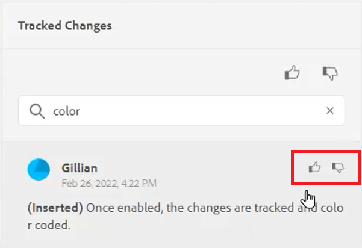

# Änderungen verfolgen

Sie können alle an einem Dokument vorgenommenen Aktualisierungen nachverfolgen, indem Sie den Modus Änderungen nachverfolgen aktivieren. In diesem Modus können Sie und Ihr Team alle Einfügungen und Löschungen während der Dokumentüberprüfung erfassen.

>[!VIDEO](https://video.tv.adobe.com/v/342763?quality=12&learn=on)

## Arbeiten mit der Funktion „Änderungen verfolgen“

1. Schalten Sie das Symbol **Änderungen nachverfolgen** ein, um die Funktion zu aktivieren (oder zu deaktivieren).

   

1. Nehmen Sie eine Änderung am Thema vor.

   Hinzugefügte Inhalte werden jetzt in Grün mit einer Änderungsleiste angezeigt. Gelöschter Inhalt wird rot mit Durchgestrichen angezeigt.

1. Wählen Sie das Symbol **Getrackte Änderungen** auf der rechten Seite, um auf das Bedienfeld „Getrackte Änderungen“ zuzugreifen.

   

1. Klicken Sie auf [!UICONTROL **Speichern**].

   

1. Schließen Sie das Thema.

Andere Benutzende können jetzt das Thema öffnen und die vorhandenen verfolgten Änderungen anzeigen. Sie können die Änderungen akzeptieren oder ablehnen und eigene hinzufügen.

## Getrackte Änderungen suchen

Die Suchfunktion ist hilfreich, wenn viele verfolgte Änderungen vorhanden sind, da das Scrollen durch diese Änderungen zeitaufwendig sein kann.

1. Wählen Sie das Symbol **Getrackte Änderungen** auf der rechten Seite, um auf das Bedienfeld „Getrackte Änderungen“ zuzugreifen.

1. Geben Sie ein Wort oder einen Satz in das Suchfeld ein.
Die Suche gibt alle Änderungen zurück, die den Suchbegriffen entsprechen.

## Getrackte Änderungen filtern

Mehrere verfolgte Änderungen können auch durch Einfügen, Löschen oder Überprüfen gefiltert werden.

1. Klicken Sie auf [!UICONTROL **Filter**] am unteren Rand des Bedienfelds „Getrackte Änderungen“.

1. Aktivieren Sie die Kontrollkästchen für die gewünschten Filter.

   

1. Klicken Sie auf [!UICONTROL **Übernehmen**].

## Übernommene Änderungen akzeptieren oder ablehnen

Reviewer und Fachexperten können Änderungen anderer Benutzer akzeptieren oder ablehnen, entweder einzeln oder gemeinsam.

1. Klicken Sie auf [!UICONTROL **Symbol „Getrackte**]&quot; auf der rechten Seite, um auf das Bedienfeld „Getrackte Änderungen“ zuzugreifen.

1. Wählen Sie eine bestimmte Änderung aus.

1. Klicken Sie auf das [!UICONTROL **Daumen hoch**] oder [!UICONTROL **Daumen runter**] Symbol, das mit der Änderung verknüpft ist, um sie zu akzeptieren oder abzulehnen.

   

   oder

   Klicken Sie auf das [!UICONTROL **Daumen hoch**] oder [!UICONTROL **Daumen runter**] Symbol über der Suchleiste, um alle Änderungen zu akzeptieren oder abzulehnen.

   

1. [!UICONTROL **Speichern**] des Themas.

## Arbeiten mit der Zusammenführungsfunktion

Wenn Sie in einer Umgebung mit mehreren Autoren arbeiten, kann es schwierig sein zu verfolgen, welche Änderungen andere Autoren in einem Thema oder einer Zuordnung vorgenommen haben. Mit der Zusammenführungsfunktion haben Sie nicht nur mehr Kontrolle über die Anzeige der Änderungen, sondern auch darüber, welche Änderungen in der neuesten Version des Dokuments beibehalten werden.

1. Öffnen Sie ein Thema im Web-Editor.

1. Klicken Sie in der Symbolleiste auf [!UICONTROL **Zusammenführen**]-Symbol.

   

1. Wählen Sie im Dialogfeld „Zusammenführen“ eine Version der Datei aus, mit der Sie die aktuelle Version der Datei vergleichen möchten.

1. Wählen Sie unter Optionen Folgendes aus:

   - **Änderungen aus ausgewählter Version verfolgen**: Diese Option zeigt alle Inhaltsaktualisierungen in Form von verfolgten Änderungen an. Sie können dann Änderungen im Dokument einzeln oder gemeinsam annehmen oder ablehnen.

   - **Auf ausgewählte Version zurücksetzen**: Diese Option setzt die aktuelle Version des Dokuments auf die ausgewählte Version zurück. Sie haben keine Kontrolle darüber, welche Inhalte akzeptiert oder abgelehnt werden.

1. Klicken Sie auf [!UICONTROL **Fertig**].

Wenn Sie die Option **Änderungen aus ausgewählter Version nachverfolgen** ausgewählt haben, werden alle Änderungen aus der ausgewählten Version auf der Registerkarte Änderungen des rechten Bedienfelds angezeigt.
