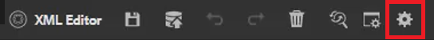

# Benutzereinstellungen, Editor-Einstellungen und Editor-Symbolleisten

Der Editor verfügt über eine hochgradig konfigurierbare Benutzeroberfläche. Durch die Kombination aus Benutzervoreinstellungen, Editor-Einstellungen und Ordnerprofilen können Sie nahezu jeden Aspekt an Ihre spezifische Arbeitsumgebung anpassen.

>[!VIDEO](https://video.tv.adobe.com/v/342769?quality=12&learn=on)

## Ein- oder Ausblenden von Element-Tags

Tags sind visuelle Hinweise auf die Begrenzungen eines Elements. Eine Elementgrenze markiert den Anfang und das Ende eines Elements. Sie können diese Umgrenzungen dann als visuellen Hinweis verwenden, um die Einfügemarke zu platzieren oder den Text innerhalb einer Umrandung auszuwählen.

1. Klicken Sie auf der [!UICONTROL **Symbolleiste auf**] Tag-Ansicht ein/aus).

   

   Tags werden im Thema angezeigt. Wenn die Tag-Ansicht aktiviert ist, können Sie:

   - Wählen Sie den Inhalt eines Elements aus, indem Sie auf das öffnende oder schließende Tag klicken.

   - Erweitern oder reduzieren Sie Tags, indem Sie auf das Pluszeichen (+) oder das Pluszeichen (-) klicken.

   - Verwenden Sie das Kontextmenü, um das ausgewählte Element auszuschneiden, zu kopieren oder einzufügen.

   - Ziehen Sie Elemente per Drag-and-Drop, indem Sie das Tag auswählen und das Element an einer gültigen Position ablegen.

1. Klicken Sie erneut auf [!UICONTROL **Symbol zum Umschalten der Tag**] Ansicht, um Tags auszublenden.

Tags verschwinden, sodass Sie sich auf den Text konzentrieren können.

## Sperren von Assets bei Verwendung

Durch Sperren (oder Auschecken) einer Datei erhält der Benutzer exklusiven Schreibzugriff auf die Datei. Wenn die Datei entsperrt (oder eingecheckt) wird, werden die Änderungen in der aktuellen Version der Datei gespeichert.

1. Klicken Sie auf [!UICONTROL **Symbol &quot;**]&quot; auf der sekundären Symbolleiste.

   

   Die Datei wurde ausgecheckt und neben dem Dateinamen im Repository wird ein Sperrsymbol angezeigt.

1. Klicken Sie auf das [!UICONTROL **Entsperren**]-Symbol.

   

Das Repository wird aktualisiert und zeigt an, dass die Datei eingecheckt wurde.

## Einfügen von Sonderzeichen

1. Klicken Sie in [!UICONTROL **sekundären Symbolleiste auf**] Symbol „Sonderzeichen einfügen“.

   

1. Geben Sie im Dialogfeld Sonderzeichen einfügen den Namen des Zeichens in die Suchleiste ein.

   Alternativ können Sie das Dropdown-Menü Kategorie auswählen verwenden, um alle Zeichen in einer bestimmten Kategorie anzuzeigen.

1. Wählen Sie das gewünschte Zeichen aus.

1. Klicken Sie [!UICONTROL **Einfügen**].

Das Sonderzeichen wird in den Text eingefügt.

## Zwischen Autoren-, Source- und Vorschaumodus wechseln

In der Symbolleiste oben rechts im Bildschirm können Sie zwischen Ansichten wechseln.

- Wählen Sie **Autor** aus, um Struktur und Inhalt bei der Arbeit mit einem Thema anzuzeigen.

- Wählen Sie **Source** aus, um die zugrunde liegende XML anzuzeigen, aus der das Thema besteht.

- Wählen Sie **Vorschau**, um anzuzeigen, wie ein Thema angezeigt wird, wenn es von einem Benutzer im Browser angezeigt wird.

## Ändern des Designs mit Benutzereinstellungen

Sie können zwischen hellen oder dunklen Designs für den Editor wählen. Unter Verwendung des hellen Designs verwenden die Symbolleisten und Bereiche einen hellgrauen Hintergrund. Unter Verwendung des dunklen Designs verwenden die Symbolleisten und Bereiche einen schwarzen Hintergrund. In beiden Designs wird der Inhaltsbearbeitungsbereich mit einem weißen Hintergrund angezeigt.

1. Klicken Sie auf [!UICONTROL **Symbol**] Benutzereinstellungen“ in der oberen Symbolleiste.

   

1. Klicken Sie im Dialogfeld Benutzereinstellungen auf die Dropdown-Liste [!UICONTROL **Design**].

1. Wählen Sie aus den verfügbaren Optionen aus.

   

1. Klicken Sie auf [!UICONTROL **Speichern**].

Der Editor wird aktualisiert, um Ihr bevorzugtes Design anzuzeigen.

## Aktualisieren des Basispfads mit Benutzereinstellungen

Sie können den Basispfad aktualisieren, damit Ihnen die Repository-Ansicht den Inhalt von einem bestimmten Speicherort anzeigt, sobald Sie den Editor starten. Dadurch wird die Zeit für den Zugriff auf Arbeitsdateien verkürzt.

1. Klicken Sie auf [!UICONTROL **Symbol**] Benutzereinstellungen“ in der oberen Symbolleiste.

   

1. Klicken Sie im Dialogfeld Benutzereinstellungen auf das [!UICONTROL **Ordner**]-Symbol neben dem Basispfad.

   

1. Aktivieren Sie im Dialogfeld Pfad auswählen das Kontrollkästchen neben einem bestimmten Ordner.

1. Klicken Sie [!UICONTROL **Auswählen**].

Wenn Sie den Editor das nächste Mal starten, zeigt das Repository die Dateien an, die im Basispfad angegeben wurden.

## Zuweisen eines neuen Ordnerprofils

Das globale Profil ist ein Systemstandard. Administratoren können zusätzliche Ordnerprofile erstellen, aus denen sie auswählen können.

1. Klicken Sie auf [!UICONTROL **Symbol**] Benutzereinstellungen“ in der oberen Symbolleiste.

   

1. Klicken Sie im Dialogfeld Benutzereinstellungen auf das Dropdown [!UICONTROL **Ordnerprofile**].

   

1. Wählen Sie ein Profil aus den verfügbaren Optionen aus.

1. Klicken Sie auf [!UICONTROL **Speichern**].

Das neue Ordnerprofil ist jetzt zugewiesen. Die Symbolleistenoptionen, Ansichtsmodi sowie Bedingungen und Ausschnitte im linken Bereich wurden geändert. Es kann auch das visuelle Erscheinungsbild von Inhalten im Editor ändern.

## Ändern des Wörterbuchs mit Editor-Einstellungen

Editor-Einstellungen stehen Administratoren zur Verfügung. Diese Einstellungen ermöglichen es Ihnen, verschiedene Einstellungen vorzunehmen. Eine davon ist das Wörterbuch, das der Editor für die Rechtschreibprüfung verwendet.

1. Klicken Sie auf [!UICONTROL **Symbol**] Editor-Einstellungen“ in der oberen Symbolleiste.

   

1. Klicken Sie im Dialogfeld Editor-Einstellungen auf die Registerkarte [!UICONTROL **Allgemein**].

1. Wählen Sie das Wörterbuch aus, mit dem Sie arbeiten möchten.

1. Klicken Sie auf [!UICONTROL **Speichern**].

Das Wörterbuch wird aktualisiert. Beachten Sie, dass Sie beim Wechsel zur AEM-Rechtschreibprüfung eine benutzerdefinierte Wortliste verwenden können.

## Ein- und Ausblenden von Bedienfeldern mit Editor-Einstellungen

Eine der Funktionen, die Sie mit Editor-Einstellungen anpassen können, sind Bedienfelder. Insbesondere können Sie auswählen, welche Bedienfelder im Editor ein- oder ausgeblendet werden sollen.

1. Klicken Sie auf [!UICONTROL **Symbol**] Editor-Einstellungen“ in der oberen Symbolleiste.

   

1. Klicken Sie im Dialogfeld Editor-Einstellungen auf die Registerkarte [!UICONTROL **Bedienfelder**].

1. Schalten Sie die verfügbaren Bedienfelder um, sodass sie angezeigt oder ausgeblendet werden.

   

1. Klicken Sie auf [!UICONTROL **Speichern**].

Das linke Bedienfeld ist jetzt so konfiguriert, dass nur die Bedienfelder angezeigt werden, die zu „Anzeigen“ umgeschaltet wurden.

## Name und Beschriftungselemente in den Editor-Einstellungen

Mit der Elementliste können Sie ein bestimmtes Element benennen und ihm eine benutzerfreundlichere Beschriftung zuweisen. Der Elementname sollte eines der DITA-Elemente sein. Die Bezeichnung kann eine beliebige Zeichenfolge sein.

1. Klicken Sie auf [!UICONTROL **Symbol**] Editor-Einstellungen“ in der oberen Symbolleiste.

   

1. Klicken Sie im Dialogfeld Editor-Einstellungen auf die Registerkarte [!UICONTROL **Elementliste**].

1. Geben Sie einen **Elementnamen** und einen **Titel** in die entsprechenden Felder ein.

1. Klicken Sie auf [!UICONTROL **Plus**], um der Liste weitere Elemente hinzuzufügen.

   

1. Klicken Sie auf [!UICONTROL **Speichern**].

Sie können die Änderung an der Elementliste sofort in den vorhandenen Tags im Editor sehen. Sie können sie auch in den Optionen sehen, die beim Hinzufügen eines neuen Elements bereitgestellt werden.

## Attribute für Namen und Titel in den Editor-Einstellungen

Die Attributliste funktioniert ähnlich wie die Elementliste. Über die Editor-Einstellungen können Sie die Liste der Attribute und deren Anzeigenamen steuern.

1. Klicken Sie auf [!UICONTROL **Symbol**] Editor-Einstellungen“ in der oberen Symbolleiste.

   

1. Klicken Sie im Dialogfeld Editor-Einstellungen auf die Registerkarte [!UICONTROL **Attributliste**].

1. Geben Sie einen **Attributnamen** und einen **Titel** in die entsprechenden Felder ein.

1. Klicken Sie auf [!UICONTROL **Plus**], um der Liste weitere Attribute hinzuzufügen.

## Konfigurieren von Bedingungen in den Editor-Einstellungen

Auf der Registerkarte Bedingung können Sie mehrere Eigenschaften konfigurieren.

1. Klicken Sie auf [!UICONTROL **Symbol**] Editor-Einstellungen“ in der oberen Symbolleiste.

   

1. Klicken Sie im Dialogfeld Editor-Einstellungen auf die Registerkarte [!UICONTROL **Bedingung**].

1. Aktivieren Sie die Kontrollkästchen der Bedingungen, die Sie anwenden möchten.

   

1. Klicken Sie auf [!UICONTROL **Speichern**].

## Erstellen eines Veröffentlichungsprofils in den Editor-Einstellungen

Publish-Profile können zum Veröffentlichen der Wissensdatenbank verwendet werden. Salesforce verwendet beispielsweise eine konfigurierte App mit einem Consumer Key und einem Consumer Secret. Mit diesen Informationen kann ein Salesforce-Veröffentlichungsprofil erstellt werden.

1. Klicken Sie auf [!UICONTROL **Symbol**] Editor-Einstellungen“ in der oberen Symbolleiste.

   

1. Klicken Sie im Dialogfeld Editor-Einstellungen auf die Registerkarte [!UICONTROL **Profile**].

1. Klicken Sie auf das [!UICONTROL **Plus**]-Symbol neben Profile.

1. Füllen Sie die Felder nach Bedarf aus.

1. Klicken Sie auf [!UICONTROL **Speichern**].

Ein Veröffentlichungsprofil wurde erstellt.
